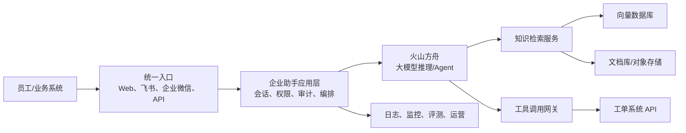

建议采用“知识检索增强 + 大模型智能体 + 工单系统工具调用”的分层架构，并按数据安全、可追溯和可运营设计。

核心组件建议：

- 文档接入与治理  
  将约 3 万份制度、产品文档统一接入火山引擎对象存储 TOS，建立文档解析、OCR、去重、版本管理、切分和元数据标注流程。元数据至少包含部门、密级、适用范围、文档版本、生效时间、失效时间和访问权限。

- 知识检索层  
  对文档分块后生成向量并写入向量数据库；检索时采用“关键词检索 + 向量检索 + 重排序”的混合检索。回答必须附带来源文档、章节和版本，低置信度时明确提示“未检索到可靠依据”，避免编造制度结论。

- 大模型与智能体  
  使用火山方舟托管模型服务，企业助手负责意图识别、知识问答、信息补全、工单操作与多轮澄清。将“查询知识”和“创建/查询/更新工单”定义为独立工具，由 Agent 根据用户意图选择调用。

- 工单系统集成  
  在工具调用网关封装现有工单 API，避免模型直接访问核心系统。典型工具包括：
  - 查询工单状态
  - 创建工单
  - 补充工单信息或上传附件
  - 转派、催办、关闭工单（高风险操作需审批）

  创建、更新、关闭等写操作应采用“先生成草稿，用户确认后执行”的两阶段机制；调用参数做强校验、幂等控制和完整审计。

- 权限与安全  
  接入企业 SSO，并将用户身份、部门和角色传递至检索与工具层。检索阶段做文档级、分块级权限过滤，确保员工只能看到有权限的内容。敏感文档、个人信息和工单内容应加密存储与传输，并配置脱敏、内容安全和操作审计。

- 应用与运行平台  
  可将企业助手服务部署在火山引擎容器服务 VKE 或云服务器 ECS 上，使用负载均衡、API 网关和缓存保障并发与稳定性；日志、链路追踪、告警和调用成本统计统一接入可观测体系。

- 评测与运营闭环  
  建立问答正确率、引用命中率、拒答准确率、工单成功率、人工转接率、响应时延和用户满意度等指标。通过用户反馈、人工抽检和高频未命中问题，持续优化文档治理、检索策略、提示词和工具编排。

建议分三期落地：

1. MVP：先接入高频、低敏的制度与产品文档，实现带出处的问答和工单查询。  
2. 扩展：加入工单创建草稿、用户确认、权限细分、运营后台和评测集。  
3. 生产化：覆盖工单更新/转派等受控操作，建设多租户隔离、容灾、成本治理和持续优化机制。

## Baseline observations
- Requirements gap list before solution: FAIL
- Only architecture-changing questions: FAIL
- Facts separated from assumptions: FAIL
- Product alternatives and switch conditions: FAIL
- Security, reliability, observability, and cost covered: PASS
- Official evidence and retrieval dates: FAIL
- Production-readiness claim appropriately bounded: PASS
