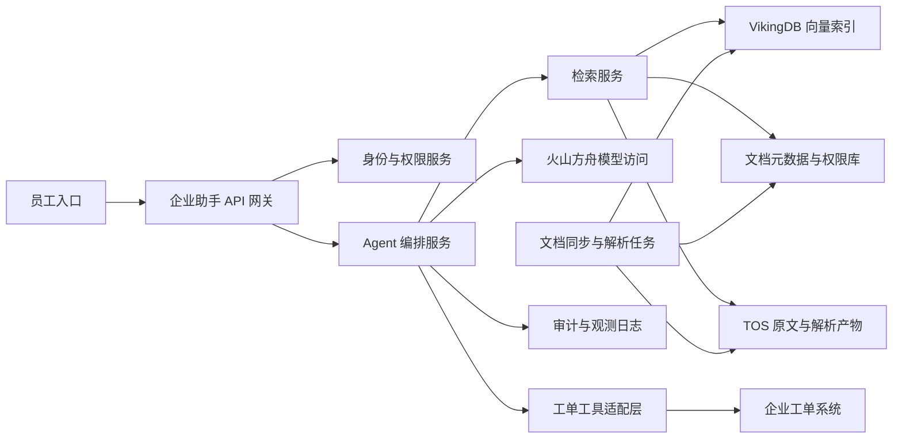

## Requirements gap check

Known facts
- 约 3 万份内部制度和产品文档。
- 目标是企业助手：回答问题，并能调用工单系统。
- 平台倾向：基于火山引擎。

Architecture-changing gaps
- 文档权限模型未知：是否需要按部门、岗位、密级做检索隔离。
- 工单系统接口未知：新建、查询、更新、审批等动作边界未定义。
- 数据敏感级别、审计留存、部署位置、混合网络边界未知。
- 响应时延、并发、恢复目标、预算约束未给出。

Assumptions if unanswered
- Assumption: 先做“只读问答 + 受控工单动作”的企业内网助手。Switch condition: 若允许自动审批或跨系统写入，增加人工确认、审批流和更严格审计。
- Assumption: 文档以文件和网页导出为主，可离线批量入库。Switch condition: 若文档高频更新，增加事件触发增量同步。
- Assumption: 每次检索都要执行用户权限过滤。Switch condition: 若所有员工可见，可简化权限索引但保留审计。

## Executive summary

建议采用“应用自持编排 + 火山方舟模型访问 + VikingDB 知识检索 + TOS 原文存储 + 托管数据库记录元数据和审计 + 容器服务承载业务网关”的架构。核心原则是把模型、知识库、权限、工具调用、审计分开治理，避免让智能体直接拥有不受控的工单权限。

该方案适合先落地制度和产品文档问答，再逐步开放工单查询、创建、更新等动作。生产授权仍需补齐部署位置、商业条款、服务目标、容量目标、工单接口权限和安全评审。

## Known facts, assumptions, and open items

Facts:
- 文档规模约为 3 万份。
- 需要问答能力和工单系统调用能力。
- 云平台选择火山引擎。

Assumptions:
- 使用 RAG，不把内部文档直接写入提示词长期保存。
- 原文进入 TOS，切片、权限标签、版本、来源进入托管数据库，向量进入 VikingDB。
- 企业助手后端统一封装模型调用、检索、工具调用、日志和权限校验。
- 工单动作默认需要二次确认；高风险动作需要人工审批。

Open items:
- 文档来源、格式、更新频率、密级和权限继承方式。
- 工单系统 API、认证方式、幂等键、回滚能力和动作白名单。
- 部署位置、网络连通、身份源、审计留存周期。
- 容量目标、服务目标、商业条款和运维责任人。

Routing:
```yaml
routing:
  scenario_labels: [AI_AGENT, CLOUD_NATIVE, BATCH_DATA, DATABASE, STORAGE]
  quality_labels: [HIGH_AVAILABILITY]
  constraint_labels: [PRIVATE_NETWORK, DATA_RESIDENCY, REGULATED, COST_SENSITIVE]
  product_families: [AI and agent, Compute and cloud native, Database and storage, Networking and security, Data and analytics]
  roles: [requirements-analyst, product-researcher, domain-architect, security-reliability-reviewer, finops-reviewer]
  execution_mode: serial
  rationale:
    - AI_AGENT: enterprise assistant, RAG, tool calling.
    - BATCH_DATA: existing documents need ingestion and re-indexing workflow.
    - PRIVATE_NETWORK: internal documents and ticketing integration imply private access paths.
    - REGULATED: internal制度 and product knowledge need permission, audit, and content controls.
    - COST_SENSITIVE: document indexing and model inference cost drivers are material.
```

## Architecture decisions

| Decision | Rationale | Alternative | Reason not selected |
| --- | --- | --- | --- |
| 应用自持智能体编排 | 便于控制权限、审计、工具白名单、回滚和多系统集成 | 完全托管智能体平台 | 生产治理、隔离和工单动作边界仍需验证 |
| RAG 优先 | 3 万份文档适合原文存储、切片、向量检索、引用回答 | 微调整体模型 | 权限、更新、可追溯性和成本边界更难控制 |
| 工单工具走后端适配层 | 统一鉴权、幂等、超时、重试、审批和审计 | 模型直接调用工单 API | 风险过高，难以证明每次动作符合用户权限 |
| 文档入库异步化 | 批量解析、切片、嵌入、索引可重试 | 用户查询时实时解析 | 体验不稳定，失败面扩大 |
| 检索时权限过滤 | 防止越权引用内部制度和产品信息 | 仅在前端菜单控制访问 | 前端控制不能覆盖 API 和模型侧泄露风险 |

## Logical architecture



关键边界:
- 员工入口只访问企业助手 API。
- Agent 编排服务不直接信任模型输出，所有工具动作先经过策略校验。
- 检索服务同时查询向量索引和权限元数据，只返回当前用户可见内容。
- 审计记录用户、问题、检索文档版本、模型调用摘要、工具动作和审批结果。

## Deployment topology

- 部署位置：待按企业数据边界和火山引擎账号可用范围确认；runtime verification required。
- 网络：一个生产 VPC，划分入口子网、应用子网、数据子网、运维子网。
- 入口：公网或企业内网入口接入负载均衡；若面向公网，前置 Web 应用防火墙。
- 应用层：容器服务运行 API 网关、编排服务、检索服务、文档处理任务和工单适配层。
- 数据层：TOS 保存原文、解析结果和索引构建中间产物；VikingDB 保存向量；托管关系型数据库保存文档元数据、权限映射、会话摘要、工具动作和审计索引；Redis 可作为短期会话和热点缓存。
- 可用区：生产至少跨多个故障域部署应用副本；数据服务的部署形态、备份和恢复能力需以目标账号运行时核验为准。
- 灾备关系：先实现备份、恢复演练和 IaC 重建；是否建设异地恢复环境取决于恢复目标和合规要求。

## End-to-end data flow

1. 文档入库，异步：文档源通过批处理任务同步到 TOS，解析为文本和结构化元数据，写入元数据与权限库；失败进入重试队列并记录错误文件。
2. 索引构建，异步：解析文本按章节切片，生成嵌入，写入 VikingDB，并绑定文档版本、权限标签和来源链接；失败切片可单独重跑。
3. 问答，同步：用户提交问题，API 网关校验身份，检索服务按用户权限召回候选片段，编排服务调用模型生成带引用回答；检索为空时返回无法确认而非编造。
4. 工单查询，同步：模型产生结构化工具意图，编排服务校验工具白名单和用户权限，工单适配层调用工单系统查询接口；超时返回可重试状态。
5. 工单创建或更新，半同步：助手先展示动作摘要、字段和值，用户确认后提交；适配层使用幂等键执行，失败时记录状态并允许人工处理。
6. 审计，异步加同步关键点：关键请求同步写入最小审计记录，详细链路日志异步补齐；审计写入失败时阻断高风险工具动作。

## Volcengine product mapping

| Architecture capability | Recommended Volcengine product | Responsibility | Why it fits | Alternative | Switch condition | Evidence |
| --- | --- | --- | --- | --- | --- | --- |
| 模型访问与评估 | 火山方舟 | 承担模型访问与评估 | 作为统一模型访问层，承载推理、评估和应用开发支撑 | 应用直接接入具体模型 API | 若需要更强平台化模型生命周期治理，继续增强方舟侧评估流程 | https://www.volcengine.com/docs/82379/66619f8df281250274ef4f88?lang=zh Retrieved: 2026-08-09 |
| 基础模型能力 | 豆包大模型 | 承担基础模型能力 | 支撑中文制度、产品文档理解和生成 | 接入其他兼容模型 | 若评测集表现或数据处理条款不满足，切换模型或多模型路由 | https://www.volcengine.com/product/doubao-dy Retrieved: 2026-08-09 |
| 知识检索 | VikingDB 向量数据库 | 承担知识检索 | 保存文档切片向量并做语义召回 | 自建向量库 | 若元数据过滤、嵌入兼容或运维要求不匹配，改为自建或混合检索 | https://www.volcengine.com/sem Retrieved: 2026-08-09 |
| 原文和解析产物 | 对象存储 TOS | 承担原文和解析产物 | 保存制度、产品文档原文、解析文本和索引中间产物 | 弹性文件存储 | 若必须以挂载文件协议访问，切换或并用弹性文件存储 | https://www.volcengine.com/docs/6349 Retrieved: 2026-08-09 |
| 应用运行 | 容器服务 | 承担应用运行 | 运行网关、编排、检索、文档处理和工单适配服务 | 云服务器 ECS 或函数服务 | 若团队缺少 Kubernetes 运维能力，采用更简单运行形态 | https://www.volcengine.com/docs/6460 Retrieved: 2026-08-09 |
| 关系型状态 | 云数据库 PostgreSQL 版或云数据库 MySQL 版 | 承担关系型状态 | 保存元数据、权限映射、会话摘要、工具动作和审计索引 | veDB MySQL 版 | 若既有系统强依赖具体数据库协议，以兼容性测试结果为准 | https://www.volcengine.com/docs/6438 Retrieved: 2026-08-09; https://www.volcengine.com/docs/6313 Retrieved: 2026-08-09 |
| 缓存与短期状态 | 缓存数据库 Redis 版 | 承担缓存与短期状态 | 缓存会话、热点权限和限流状态，不作为唯一持久记录 | 应用内缓存 | 若一致性要求高于缓存收益，可取消该层 | https://www.volcengine.com/docs/6293 Retrieved: 2026-08-09 |
| 私有网络边界 | 私有网络 | 承担私有网络边界 | 隔离应用、数据和运维访问路径 | 单平面网络 | 若安全分区要求降低，可简化子网但不取消最小权限 | https://www.volcengine.com/docs/6401 Retrieved: 2026-08-09 |
| 入口分发 | 负载均衡 | 承担入口分发 | 为企业助手 API 提供统一入口和后端健康检查 | 直接暴露单实例入口 | 若仅 PoC 内部使用，可临时简化 | https://www.volcengine.com/docs/6406 Retrieved: 2026-08-09 |
| 身份与密钥 | 访问控制 IAM 与密钥管理系统 | 承担身份与密钥 | 管理云资源访问、临时凭证和加密密钥 | 应用自管密钥 | 若企业已有统一密钥平台，需验证集成边界 | https://www.volcengine.com/docs/6257/64959?lang=zh Retrieved: 2026-08-09; https://www.volcengine.com/product/kms Retrieved: 2026-08-09 |
| Web/API 防护 | Web应用防火墙与云防火墙 | 承担Web/API 防护 | 保护入口和网络边界，输出安全日志 | 仅安全组控制 | 若入口完全在企业专网内，可按风险评估调整 | https://www.volcengine.com/docs/6511 Retrieved: 2026-08-09; https://www.volcengine.com/docs/6516 Retrieved: 2026-08-09 |
| 数据治理编排 | 大数据研发治理套件 DataLeap | 承担数据治理编排 | 可用于文档处理任务编排、元数据治理和质量规则 | 轻量自建调度 | 若数据团队不使用治理平台，先用容器任务和流水线实现 | https://www.volcengine.com/docs/6260 Retrieved: 2026-08-09 |

## Non-functional design

Capacity and elasticity:
- 文档索引构建与在线问答分离；批处理可排队扩缩，在线服务保持独立容量池。
- 容量目标需要用真实文档大小、切片数、并发、平均上下文长度和工单调用频率测算；runtime verification required。

Availability and recovery:
- API、编排、检索、工具适配层无状态化，多副本部署。
- 元数据、向量、对象和审计数据按服务能力配置备份与恢复演练。
- 恢复目标未给出，生产前必须补齐并完成演练。

Security and compliance:
- 用户身份贯穿检索和工单执行；禁止仅靠模型判断权限。
- 对制度和产品文档做密级、来源、版本、拥有者、可见范围标记。
- 工单工具使用白名单、结构化参数、二次确认、幂等键、超时和审计。
- 对提示注入、越权检索、敏感信息外泄、危险工具调用做专项测试。

Observability:
- 记录请求链路、检索命中文档、模型版本别名、提示模板版本、工具动作、失败原因和人工审批结果。
- 对回答无引用、检索低置信、工具失败、异常调用量建立告警。

Performance:
- 采用混合检索、重排和缓存热点权限数据。
- 大文档预切片，避免查询时解析。
- 模型调用设超时、降级和重试边界，避免工单系统被级联拖垮。

Cost:
- 成本驱动包括文档解析、嵌入生成、向量存储、模型调用、对象存储、数据库、容器计算和日志留存。
- 优化手段包括增量索引、去重、缓存、分层日志、评测后选择模型、按部门灰度开放工具。
- 商业条款和容量目标未核验，不提供金额估算。

## Implementation roadmap

PoC:
- 接入一批代表性制度和产品文档。
- 完成解析、切片、向量索引、引用回答。
- 接入工单沙箱，仅开放查询和创建草稿。
- Acceptance: 能回答高频问题，答案带引用；越权文档不可见；工具调用有确认和审计。

Minimum production:
- 接入企业身份源、权限同步、生产工单接口。
- 完成入口防护、私有网络、密钥管理、审计留存、备份恢复演练。
- 建立评测集、提示模板版本管理和发布回滚。
- Acceptance: 权限、审计、恢复、告警和工具幂等通过演练。

Scale phase:
- 扩展文档源和增量同步。
- 引入更细粒度质量评测、反馈闭环、知识负责人工作台。
- 根据真实用量调优模型、检索、缓存和批处理资源。
- Acceptance: 主要部门可自助接入文档，质量和成本可按业务线归因。

## Risk and validation plan

| Risk | Probability | Impact | Mitigation | Owner | Validation method |
| --- | --- | --- | --- | --- | --- |
| 文档权限继承错误导致越权回答 | Medium | High | 入库权限校验、检索时再校验、审计抽样 | 安全负责人 | 构造跨部门访问测试 |
| 模型受恶意文档诱导调用工具 | Medium | High | 提示注入检测、工具白名单、二次确认 | AI 应用负责人 | 红队测试和工具调用回放 |
| 工单重复创建或状态不一致 | Medium | Medium | 幂等键、状态机、补偿任务 | 工单系统负责人 | 故障注入和重放测试 |
| 文档更新后索引陈旧 | Medium | Medium | 增量同步、版本号、过期标记 | 知识库负责人 | 文档变更到可检索链路测试 |
| 运行成本不可控 | Medium | Medium | 评测驱动模型选择、缓存、增量索引、成本标签 | FinOps | 用真实样本做月度测算 |
| 服务恢复目标无法达成 | Unknown | High | 明确恢复目标、备份策略和演练 | 运维负责人 | 恢复演练报告 |

Serial role pass:
- Security/reliability review: 最大风险是权限穿透、工具越权和恢复目标缺失；上线前必须完成专项验证。
- FinOps review: 不能用文档数直接估算费用，必须采集文档体积、切片数、问答量、工具调用量和日志留存策略。

## Official evidence and freshness

No browsing was performed. The following are official Volcengine discovery URLs from the local skill reference; each architecture-critical dynamic item still needs runtime verification required for the target account and deployment context.

- 火山方舟: https://www.volcengine.com/docs/82379/66619f8df281250274ef4f88?lang=zh Retrieved: 2026-08-09
- 豆包大模型: https://www.volcengine.com/product/doubao-dy Retrieved: 2026-08-09
- 火山引擎产品总览: https://www.volcengine.com/sem Retrieved: 2026-08-09
- 容器服务: https://www.volcengine.com/docs/6460 Retrieved: 2026-08-09
- TOS: https://www.volcengine.com/docs/6349 Retrieved: 2026-08-09
- PostgreSQL: https://www.volcengine.com/docs/6438 Retrieved: 2026-08-09
- MySQL: https://www.volcengine.com/docs/6313 Retrieved: 2026-08-09
- Redis: https://www.volcengine.com/docs/6293 Retrieved: 2026-08-09
- 私有网络: https://www.volcengine.com/docs/6401 Retrieved: 2026-08-09
- 负载均衡: https://www.volcengine.com/docs/6406 Retrieved: 2026-08-09
- IAM: https://www.volcengine.com/docs/6257/64959?lang=zh Retrieved: 2026-08-09
- KMS: https://www.volcengine.com/product/kms Retrieved: 2026-08-09
- WAF: https://www.volcengine.com/docs/6511 Retrieved: 2026-08-09
- 云防火墙: https://www.volcengine.com/docs/6516 Retrieved: 2026-08-09
- DataLeap: https://www.volcengine.com/docs/6260 Retrieved: 2026-08-09

## Completeness score

Requirements: 1
Architecture: 1
Security: 1
Reliability: 1
Cost: 1
Evidence: 1
Production readiness: NOT READY

Blocker: 部署位置、商业条款、服务目标、容量目标、权限模型、工单接口动作边界和官方运行时核验尚未完成。

## Forward observations
- Requirements gap list before solution: PASS
- Only architecture-changing questions: PASS
- Facts separated from assumptions: PASS
- Product alternatives and switch conditions: PASS
- Security, reliability, observability, and cost covered: PASS
- Official evidence and retrieval dates: PASS
- Production-readiness claim appropriately bounded: PASS
