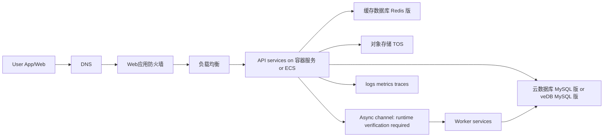

## Requirements gap check
Known facts
- 电商 API 迁移到火山引擎。
- 日活 300 万，晚间存在突发流量。
- 目标是尽量少改代码。

Architecture-changing gaps
- 现有运行形态、语言框架、数据库、中间件、缓存、对象文件、消息队列未知。
- 数据迁移窗口、回滚目标、service target、数据分级、审计留存和恢复目标未知。
- 晚间峰值曲线、接口画像、容量目标、外部支付/仓储/短信依赖未知。

Assumptions if unanswered
- Assumption: API 可容器化且以 secure HTTP 提供服务。Switch condition: If 依赖固定主机、本地文件或特殊系统能力，首期改用 ECS 平移。
- Assumption: 主交易库为 MySQL 兼容关系型数据库，热点读可使用 Redis 类缓存。Switch condition: If 实际为 PostgreSQL、MongoDB 或专有数据库，重选数据库产品和迁移路径。
- Assumption: 首期在一个 deployment location 内多可用区部署。Switch condition: If 业务要求跨 deployment location 恢复，增加复制、切流和演练设计。

## Executive summary
建议采用“WAF + 负载均衡 + 容器服务优先 + 托管关系型数据库 + Redis 缓存 + 对象存储 + 可观测性”的低改造迁移方案。应用通过镜像、环境变量和配置迁移，状态下沉到托管数据产品，晚间突发流量通过弹性扩缩、缓存预热、异步削峰、限流降级和数据库保护承接。

本方案是受限生产设计草案。由于未实时联网核验商业条款、deployment location 可用性、容量边界、service target 和兼容性，生产 readiness 保持 NOT READY。

## Known facts, assumptions, and open items
Facts
- 业务是电商 API，规模为日活 300 万。
- 晚间突发流量是核心容量风险。
- 迁移目标是尽量少改代码。

Assumptions
- Assumption: API 服务可无状态化。Switch condition: If 会话或文件强依赖本地状态，先迁出状态或以 ECS 过渡。
- Assumption: 商品、活动、会话、限流状态可缓存。Switch condition: If 数据一致性要求不允许缓存，改为数据库读扩展和更严格限流。
- Assumption: 下单、库存、支付回调是核心强一致链路。Switch condition: If 订单流程已有独立交易中台，云上只承载 API 层和集成层。
- Assumption: 图片、导出文件和归档日志适合对象语义。Switch condition: If 应用必须共享文件挂载，评估弹性文件存储。

Open items
- 现有技术栈、数据库类型、数据量、慢查询、连接池和缓存命令兼容性。
- 峰值曲线、容量目标、错误预算、恢复目标、停机容忍度。
- 数据分级、密钥归属、审计留存、合规边界。
- 外部依赖的网络路径、超时策略、幂等机制和回滚流程。

```yaml
routing:
  scenario_labels: [CLOUD_NATIVE, DATABASE, STORAGE]
  quality_labels: [LOW_LATENCY, HIGH_THROUGHPUT, HIGH_AVAILABILITY, DISASTER_RECOVERY]
  constraint_labels: [PRIVATE_NETWORK, COST_SENSITIVE, MIGRATION]
  product_families: [compute-cloud-native, database-storage, networking-security]
  roles: [requirements-analyst, product-researcher, domain-architect, security-reliability-reviewer, finops-reviewer]
  execution_mode: serial
  rationale:
    - CLOUD_NATIVE: 电商 API 迁移和弹性运行是主目标。
    - DATABASE/STORAGE: 交易数据、缓存、对象文件需要独立设计。
    - HIGH_THROUGHPUT: 晚间突发流量要求削峰和扩缩。
    - MIGRATION: 用户明确要求尽量少改代码。
    - COST_SENSITIVE: 日活 300 万使成本驱动需要 FinOps 评审。
```

## Architecture decisions
| Decision | Rationale | Alternative | Reason not selected |
| --- | --- | --- | --- |
| API 优先运行在容器服务 | 镜像化迁移可保留代码和协议，同时支持编排、发布和扩缩 | ECS 平移 | 适合主机依赖场景，但弹性和发布治理较弱 |
| 保留 ECS 作为兼容性后备路径 | 少改代码目标需要容纳无法快速容器化的服务 | 全量容器化一次完成 | 兼容性未知时切换风险更高 |
| 交易库使用 MySQL 兼容托管数据库优先 | 常见电商交易模型适合关系型事务和托管运维 | 自建数据库 on ECS | 运维、备份、恢复责任更重 |
| Redis 类缓存承接热点读和瞬时状态 | 商品、活动、会话和限流状态可降低数据库压力 | 仅扩容数据库 | 晚间突发时保护不足 |
| 引入异步削峰处理非核心动作 | 通知、积分、导出等动作不应阻塞下单核心链路 | 全同步调用 | 外部依赖抖动会放大用户请求延迟 |
| 公网入口采用 WAF 与负载均衡 | 将应用防护、健康检查和后端摘除放在统一入口 | 应用直接暴露 | 边界控制、审计和故障隔离不足 |

## Logical architecture


## Deployment topology
- Deployment location: choose the nearest compliant Volcengine deployment location after runtime verification; do not finalize before account and workload checks.
- Availability zones: place ingress backends, application capacity, database replicas and cache nodes across multiple fault domains when supported and verified.
- VPC: isolate production, staging and test; use public ingress subnet, private application subnet, private data subnet and management subnet.
- Ingress: DNS routes to WAF, WAF forwards to load balancing, load balancing reaches only private backends.
- Egress: external payment, SMS, ERP and warehouse calls use controlled outbound paths with timeout, retry and audit rules.
- Disaster recovery: minimum phase covers backup restore and same-location failover; cross-location recovery remains an open item until recovery objectives are confirmed.

## End-to-end data flow
1. 商品读取: synchronous secure HTTP enters WAF and load balancing, API reads Redis first, falls back to database on miss, writes cache with controlled TTL, and rate-limits if cache fails.
2. 下单: synchronous request validates identity, idempotency key and stock rule, writes order state to database, then emits noncritical work asynchronously; retry exhaustion enters compensation.
3. 库存: synchronous database transaction or inventory service update protects authoritative stock; activity spikes can switch to queueing, presale or sold-out guard.
4. 支付回调: external callback reaches API through protected ingress, API verifies signature and idempotency, updates order state, and asynchronously notifies downstream systems.
5. 文件对象: API stores images/export files in TOS and records object identifiers in database; failed object writes prevent business commit or enter compensating cleanup.
6. Operations: every ingress, API, worker, database and cache path emits logs, metrics and traces; alerts trigger scale-out, degrade, rollback or manual response.

## Volcengine product mapping
| Architecture capability | Recommended Volcengine product | Why it fits | Alternative | Switch condition | Evidence |
| --- | --- | --- | --- | --- | --- |
| API orchestration | 容器服务 | Managed Kubernetes fits image-based API deployment and multi-service orchestration | 云服务器 ECS | If host-level dependencies block containerization, start with ECS | https://www.volcengine.com/docs/6460 Retrieved: 2026-08-09 |
| Host-compatible migration | 云服务器 ECS | Supports virtual-machine migration when OS control is required | 容器服务 | If services are container-ready, prefer container service | https://www.volcengine.com/sem Retrieved: 2026-08-09 |
| Compute elasticity | 弹性伸缩 | Supports policy-driven compute capacity adjustment for VM backends | Kubernetes scaling | If workload is on container service, use platform-native scaling first | https://www.volcengine.com/docs/6406 Retrieved: 2026-08-09 |
| Private isolation | 私有网络 | Provides VPC, subnets, routing and security boundaries | Flat network | If only PoC, simplify temporarily but not for production | https://www.volcengine.com/docs/6401 Retrieved: 2026-08-09 |
| Public API distribution | 负载均衡 | Provides shared entry, backend health checks and traffic distribution | Self-managed proxy | If unsupported routing behavior is required, evaluate self-managed proxy | https://www.volcengine.com/docs/6406 Retrieved: 2026-08-09 |
| Web/API protection | Web应用防火墙 | Protects public web and API traffic with application-layer controls | Security groups only | If API is private-only, reduce to internal controls | https://www.volcengine.com/docs/6511 Retrieved: 2026-08-09 |
| Transaction database | 云数据库 MySQL 版 | Managed MySQL-compatible access fits common ecommerce transaction workloads | veDB MySQL 版 | If read scaling or cloud-native database behavior is more important, evaluate veDB | https://www.volcengine.com/docs/6313 Retrieved: 2026-08-09 |
| Read-scaled relational option | 云数据库 veDB MySQL 版 | MySQL-compatible cloud-native relational option for read-heavy paths | 云数据库 MySQL 版 | If compatibility testing fails, use standard MySQL product | https://www.volcengine.com/docs/6357 Retrieved: 2026-08-09 |
| Hot cache | 缓存数据库 Redis 版 | Redis-compatible cache fits sessions, product hot data and rate-limit state | Application cache | If command compatibility fails, retain current cache first | https://www.volcengine.com/docs/6293 Retrieved: 2026-08-09 |
| Object files | 对象存储 TOS | Object storage fits images, exports and immutable artifacts | 弹性文件存储 | If mounted file semantics are mandatory, evaluate file storage | https://www.volcengine.com/docs/6349 Retrieved: 2026-08-09 |
| Identity authorization | 访问控制 IAM | Central authorization for people and workload access | Static credentials | If legacy code cannot use roles, use temporary transitional secrets | https://www.volcengine.com/docs/6257/64959?lang=zh Retrieved: 2026-08-09 |
| Key governance | 密钥管理系统 | Managed key custody supports encryption and rotation governance | App-managed keys | If customer-controlled custody is required, design a dedicated key process | https://www.volcengine.com/product/kms Retrieved: 2026-08-09 |

## Non-functional design
Capacity and elasticity: derive capacity target from production traces and load tests, not from DAU alone; pre-warm cache and pre-scale before campaigns.
Availability and recovery: avoid single-instance dependencies, define health checks, graceful drain, rollback, backup restore and recovery drills before cutover.
Security and compliance: expose only WAF/load-balancing ingress publicly, keep app/data private, use IAM least privilege, KMS-managed secrets, log masking and audit retention.
Observability: monitor ingress success, API latency, database saturation, Redis health, async backlog, business errors and rollback indicators.
Performance: cache product and campaign reads, isolate order/payment paths, cap retries, protect database connections and test hot keys, slow SQL and external dependency delays.
Cost: main drivers are compute, database, cache, ingress traffic, object storage and logs; use autoscaling, lifecycle policies, log retention controls and campaign capacity reviews.
Serial role pass: security/reliability review finds recovery objectives, data classification and failure-domain validation unresolved; FinOps review cannot estimate cost without peak curve, storage growth and log volume.

## Implementation roadmap
PoC phase: containerize one low-risk API, connect test VPC, load balancing, test database, Redis and logging. Acceptance criteria: functional tests pass, deploy/rollback works, basic logs are searchable.
Minimum production phase: migrate core APIs, database, cache and object files; configure ingress protection, backup restore, alerts, runbooks and rollback. Acceptance criteria: load test meets agreed capacity target, migration rehearsal passes, rollback is rehearsed.
Scale phase: add campaign runbooks, autoscaling, cache warmup, async backlog controls, read optimization and degradation switches. Acceptance criteria: evening-spike simulation passes with documented failure handling.

## Risk and validation plan
| Risk | Probability | Impact | Mitigation | Owner | Validation method |
| --- | --- | --- | --- | --- | --- |
| Peak profile is wrong | High | High | Capture real traffic and replay load tests | Architecture owner | Load-test report |
| Database incompatibility | Medium | High | Test schema, SQL, drivers and transactions | DBA | Migration rehearsal |
| Cache hot key or penetration | Medium | High | Warmup, mutex rebuild, TTL jitter, rate limits | Backend owner | Fault injection |
| Duplicate order processing | Medium | High | Idempotency key and state machine | Transaction owner | Replay tests |
| External dependency latency | Medium | High | Timeout, circuit breaker, async compensation | Integration owner | Dependency drill |
| Recovery objective undefined | High | High | Agree recovery objective and rehearse restore | Business owner | Restore drill |
| Overbroad permissions | Medium | High | IAM least privilege and key rotation | Security owner | Access review |
| Cost surprise | Medium | Medium | Build usage model and campaign review | FinOps owner | Cost model review |

## Official evidence and freshness
- A-level discovery evidence: 容器服务 https://www.volcengine.com/docs/6460 Retrieved: 2026-08-09; ECS https://www.volcengine.com/sem Retrieved: 2026-08-09; 弹性伸缩/负载均衡 https://www.volcengine.com/docs/6406 Retrieved: 2026-08-09.
- A-level discovery evidence: 私有网络 https://www.volcengine.com/docs/6401 Retrieved: 2026-08-09; WAF https://www.volcengine.com/docs/6511 Retrieved: 2026-08-09; IAM https://www.volcengine.com/docs/6257/64959?lang=zh Retrieved: 2026-08-09; KMS https://www.volcengine.com/product/kms Retrieved: 2026-08-09.
- A-level discovery evidence: MySQL https://www.volcengine.com/docs/6313 Retrieved: 2026-08-09; veDB MySQL https://www.volcengine.com/docs/6357 Retrieved: 2026-08-09; Redis https://www.volcengine.com/docs/6293 Retrieved: 2026-08-09; TOS https://www.volcengine.com/docs/6349 Retrieved: 2026-08-09.
- Freshness boundary: no browsing was performed; deployment location, commercial terms, service target, capacity target, compatibility details and operational limits require runtime verification before approval.

## Completeness score
Requirements: 1
Architecture: 1
Security: 1
Reliability: 1
Cost: 1
Evidence: 1
Production readiness: NOT READY

Blocker: peak workload profile, recovery objectives, data compatibility, deployment location, service target, capacity target, security ownership and commercial terms remain unresolved.

## Forward observations
- Requirements gap list before solution: PASS
- Only architecture-changing questions: PASS
- Facts separated from assumptions: PASS
- Product alternatives and switch conditions: PASS
- Security, reliability, observability, and cost covered: PASS
- Official evidence and retrieval dates: PASS
- Production-readiness claim appropriately bounded: PASS
