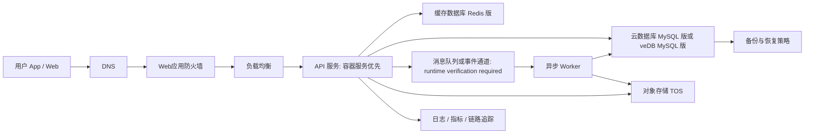

## Requirements gap check
Known facts
- 电商 API 迁移到火山引擎。
- 日活 300 万，晚间有突发流量。
- 目标是尽量少改代码。

Architecture-changing gaps
- 现有运行形态、语言框架、数据库、中间件、缓存、对象文件、消息队列未知。
- 数据迁移窗口、回滚目标、服务目标、数据分级、合规边界未知。
- 晚间峰值画像缺失，容量目标需压测后确定。

Assumptions if unanswered
- Assumption: 现有 API 可容器化，入口为 HTTP API，后端以关系型数据库和 Redis 类缓存为主。Switch condition: If 依赖本地文件、固定主机、特殊内核能力，则部分服务改用 ECS 承载。
- Assumption: 优先采用兼容托管组件以减少代码改造。Switch condition: If 现有组件协议不兼容，则保留自建组件或先做适配层。
- Assumption: 首期同一 deployment location 内多可用区部署。Switch condition: If 有异地恢复要求，则增加跨 deployment location 灾备链路，runtime verification required。

## Executive summary
建议采用“入口防护 + 负载均衡 + 托管 Kubernetes 或 ECS + 托管数据库 + Redis 缓存 + 对象存储 + 可观测性”的迁移架构。主路径优先容器化部署到火山引擎容器服务，保留原 API 代码、配置和协议，数据库与缓存迁移到兼容托管产品。

晚间突发流量通过弹性扩容、缓存前置、异步削峰、读写分离和降级开关承接。由于禁止联网，本方案不确认商业条款、服务目标、容量目标、deployment location 可用性或产品形态细节；这些必须在实施前 runtime verification required。

## Known facts, assumptions, and open items
Facts
- 业务为电商 API。
- 活跃用户规模为日活 300 万。
- 存在晚间突发流量。
- 迁移目标是尽量少改代码。

Assumptions
- API 是无状态或可改造成无状态。
- 用户会话、购物车、热点商品信息可缓存。
- 订单、库存、支付回调走强一致业务流程。
- 图片、导入导出文件、日志归档适合对象语义存储。

Open items
- 现有数据库类型、表规模、慢查询、连接池行为。
- 峰值请求曲线、接口耗时、错误预算、服务目标。
- 支付、ERP、仓储、短信、风控等外部依赖方式。
- 数据分类、密钥归属、审计留存要求。
- 回滚窗口、停机容忍度、灾备目标。

## Architecture decisions
| Decision | Rationale | Alternative | Reason not selected |
| --- | --- | --- | --- |
| API 运行在容器服务优先 | 保留应用代码，通过镜像、环境变量和配置迁移，适合多服务编排 | ECS 虚机部署 | 适合低改造但发布、弹性和治理粒度较弱 |
| 数据库使用兼容托管关系型产品 | 减少 DBA 运维，保留 SQL 与驱动习惯 | 自建数据库 on ECS | 运维和恢复责任更重 |
| Redis 类缓存前置热点读路径 | 降低商品、活动、会话等热点读压力 | 仅靠数据库扩容 | 突发场景风险更高 |
| 订单链路引入异步削峰 | 下单后库存锁定、通知、积分等非核心动作异步化 | 所有动作同步执行 | 晚间突发时更容易拖垮核心 API |
| 公网 API 前置 WAF 和负载均衡 | 明确入口防护、健康检查和后端摘除 | 应用直接暴露公网 | 边界控制和故障隔离不足 |
| 对象文件进入 TOS | 图片、导出文件、静态资产与应用解耦 | 放在应用本地磁盘 | 不利于弹性和替换实例 |

## Logical architecture


Design notes
```yaml
routing:
  scenario_labels: [CLOUD_NATIVE, DATABASE, STORAGE]
  quality_labels: [LOW_LATENCY, HIGH_THROUGHPUT, HIGH_AVAILABILITY, DISASTER_RECOVERY]
  constraint_labels: [PRIVATE_NETWORK, COST_SENSITIVE, MIGRATION]
  product_families: [compute-cloud-native, database-storage, networking-security]
  roles: [requirements-analyst, product-researcher, domain-architect, security-reliability-reviewer, finops-reviewer]
  execution_mode: serial
  rationale:
    - CLOUD_NATIVE: API 迁移和弹性运行是主需求。
    - DATABASE/STORAGE: 电商交易数据、缓存和对象文件需要独立设计。
    - HIGH_THROUGHPUT: 晚间突发流量要求弹性和削峰。
    - MIGRATION: 明确要求少改代码迁移。
    - COST_SENSITIVE: 大规模日活使成本驱动需要单独评审。
```

## Deployment topology
- Deployment location: 首期选择一个业务主要访问地接近的火山引擎 deployment location，runtime verification required。
- 可用区: API、负载均衡后端、容器节点、数据库副本、缓存节点跨多个故障域部署，具体可选项 runtime verification required。
- VPC: 生产、预发、测试隔离；生产 VPC 内划分公网入口子网、应用私有子网、数据私有子网、管理子网。
- Ingress: DNS 指向 WAF，WAF 转发到负载均衡，负载均衡仅访问私有后端。
- Egress: 访问支付、短信、ERP 等外部系统通过受控出口，固定出口地址策略 runtime verification required。
- Disaster recovery: 首期做备份恢复和同 deployment location 内故障切换；若业务要求跨 deployment location 恢复，再增加数据复制、流量切换演练和只读降级方案。

## End-to-end data flow
1. 用户读商品: 同步 HTTP 请求进入 WAF 和负载均衡，API 先查 Redis，未命中再查数据库，结果回填缓存；缓存异常时降级为数据库读取并限流。
2. 用户下单: 同步 HTTP 请求进入 API，API 校验登录、库存和幂等键，写入订单主表；非关键动作发送到异步通道，失败进入重试和人工补偿。
3. 库存扣减: 核心库存更新走数据库事务或库存服务，热点活动可采用预扣库存与补偿机制；冲突过高时启用排队或售罄保护。
4. 支付回调: 外部支付系统回调 API，API 校验签名和幂等状态，更新订单；下游通知异步处理，重复回调直接返回已处理结果。
5. 文件与图片: API 上传对象到 TOS，数据库保存对象标识和业务元数据；对象上传失败时不提交业务状态或进入补偿队列。
6. 运维观测: API、Worker、数据库、缓存、入口组件输出日志、指标和链路信息；告警触发扩容、降级、回滚或人工处置。

## Volcengine product mapping
| Architecture capability | Recommended Volcengine product | Why it fits | Alternative | Switch condition | Evidence |
| --- | --- | --- | --- | --- | --- |
| API 运行编排 | 容器服务 | 支持 Kubernetes 编排，适合镜像化 API 和弹性发布 | 云服务器 ECS | If 应用无法快速容器化或依赖主机级能力，先用 ECS 平移 | https://www.volcengine.com/docs/6460 |
| 低改造虚机承载 | 云服务器 ECS | 适合保留现有进程、系统包和部署脚本 | 容器服务 | If 团队已有容器交付能力，切回容器服务 | https://www.volcengine.com/sem |
| 弹性容量调整 | 弹性伸缩 | 用于后端算力随负载扩缩 | 容器原生扩缩机制 | If 容器平台承载主工作负载，优先使用容器扩缩能力 | https://www.volcengine.com/docs/6406 |
| API 入口分发 | 负载均衡 | 提供统一入口、后端健康检查和流量分发 | 应用自建入口代理 | If 需要特殊七层插件且托管入口无法满足，再自建代理 | https://www.volcengine.com/docs/6406 |
| 网络隔离 | 私有网络 | 提供 VPC、子网、路由和安全边界 | 单一扁平网络 | If 只是 PoC 可简化，但生产不建议 | https://www.volcengine.com/docs/6401 |
| Web/API 防护 | Web应用防火墙 | 适合公网 Web 和 API 请求防护 | 仅安全组和应用校验 | If API 不暴露公网，可降低为内网边界控制 | https://www.volcengine.com/docs/6511 |
| 关系型交易库 | 云数据库 MySQL 版 | 适合 MySQL 兼容应用迁移和托管运维 | 云数据库 veDB MySQL 版 | If 读扩展和云原生数据库能力更关键，评估 veDB MySQL | https://www.volcengine.com/docs/6313 |
| 云原生关系型交易库 | 云数据库 veDB MySQL 版 | 适合 MySQL 兼容且关注读扩展的场景 | 云数据库 MySQL 版 | If 兼容性验证不通过，回到云数据库 MySQL 版 | https://www.volcengine.com/docs/6357 |
| 热点缓存 | 缓存数据库 Redis 版 | 适合会话、商品、活动、令牌、限流状态缓存 | 应用内缓存 | If 一致性风险过高，仅缓存可重建读数据 | https://www.volcengine.com/docs/6293 |
| 对象文件 | 对象存储 TOS | 适合图片、导出文件、归档对象 | 弹性文件存储 | If 应用必须 POSIX 文件语义，评估弹性文件存储 | https://www.volcengine.com/docs/6349 |
| 共享文件语义 | 弹性文件存储 | 适合多个实例共享挂载文件 | TOS | If 可改为对象访问，优先 TOS | https://www.volcengine.com/docs/6453 |
| 身份授权 | 访问控制 IAM | 用于人员和工作负载权限治理 | 长期静态密钥 | If 应用暂无法改造，先用密钥托管和轮换过渡 | https://www.volcengine.com/docs/6257/64959?lang=zh |
| 密钥治理 | 密钥管理系统 | 用于密钥托管、加密和轮换治理 | 应用自管密钥 | If 合规要求客户自管流程，需专项设计 | https://www.volcengine.com/product/kms |
| 网络边界审计 | 云防火墙 | 适合云上网络边界策略和审计 | 仅安全组 | If 边界检查要求较低，可阶段二引入 | https://www.volcengine.com/docs/6516 |

## Non-functional design
Capacity and elasticity
- 以压测生成容量目标，不直接从日活推导实例数量。
- API 水平扩展，保留无状态原则；连接池、线程池、缓存连接数作为扩缩约束。
- 晚间活动前预热缓存、预扩后端、冻结非必要发布。

Availability and recovery
- 入口、应用、缓存、数据库都避免单实例依赖。
- 数据库定期备份，恢复演练纳入上线门禁。
- 关键接口具备幂等键、重试边界和手工补偿路径。

Security and compliance
- 公网只暴露 WAF 与负载均衡入口，应用与数据层保持私网访问。
- IAM 最小权限，CI/CD、运行时、运维人员分离授权。
- 敏感配置进入密钥系统或托管 Secret，不写入镜像和仓库。
- 日志脱敏，支付、手机号、地址等字段按数据分级处理。

Observability
- 建立四类视图：入口成功率、API 延迟、数据库与缓存健康、异步积压。
- 每个核心接口配置链路追踪、错误码归因和业务指标。
- 告警按用户影响分级，避免只监控资源使用率。

Performance
- 商品详情、首页推荐、活动页配置走缓存和本地短缓存。
- 下单、支付、库存链路减少跨服务同步依赖。
- 慢 SQL、热点 key、大对象上传、连接池耗尽作为压测重点。

Cost
- 主要成本驱动为计算、数据库、缓存、入口流量、对象存储、日志留存。
- 优化杠杆包括按峰谷扩缩、冷热数据分层、日志采样、缓存命中率提升、活动前容量预案。
- 商业条款和计费模型 runtime verification required。

Serial role pass
- Security/reliability review: 最大风险是数据层恢复目标和跨故障域部署未被业务确认。
- FinOps review: 缺少峰值曲线、接口画像、数据增长、日志量和对象访问模式，不能给出可信成本测算。

## Implementation roadmap
PoC phase
- 容器化 1 到 2 个低风险 API。
- 接入测试 VPC、负载均衡、托管数据库测试实例、Redis 测试实例。
- Acceptance criteria: 核心读写接口功能通过，镜像发布和回滚可执行，基础日志可查询。

Minimum production phase
- 迁移核心 API、数据库、缓存和对象文件。
- 建立蓝绿或灰度发布、备份恢复演练、入口防护策略、告警值班流程。
- Acceptance criteria: 压测达到约定容量目标，故障演练通过，回滚方案在演练环境验证。

Scale phase
- 引入活动预案、自动扩缩、异步削峰、缓存预热、只读降级和容量看板。
- 优化数据库索引、读路径和热点 key。
- Acceptance criteria: 晚间突发演练通过，核心链路具备限流、降级、补偿和审计记录。

## Risk and validation plan
| Risk | Probability | Impact | Mitigation | Owner | Validation method |
| --- | --- | --- | --- | --- | --- |
| 峰值画像不足导致容量目标失真 | Medium | High | 采集现网指标并压测复现晚间曲线 | 架构负责人 | 压测报告和容量评审 |
| 数据库兼容性问题 | Medium | High | 先做 schema、SQL、驱动、事务语义验证 | DBA | 迁移演练和回归测试 |
| 缓存穿透或热点 key | Medium | High | 预热、互斥重建、限流、热点隔离 | 后端负责人 | 压测和故障注入 |
| 订单链路重复处理 | Medium | High | 全链路幂等键和状态机 | 交易负责人 | 重放测试 |
| 外部支付或仓储依赖拖慢核心 API | Medium | High | 超时、隔离、异步补偿 | 集成负责人 | 依赖故障演练 |
| 商业条款不可控 | Medium | Medium | 上线前核算资源、流量、日志、存储消耗 | FinOps | 成本模型评审 |
| 灾备目标未定义 | High | High | 明确恢复目标并演练 | 业务负责人 | 恢复演练记录 |
| 权限边界过宽 | Medium | High | IAM 最小权限、密钥轮换、审计 | 安全负责人 | 权限审计 |

## Official evidence and freshness
Evidence used
- 容器服务 documentation: https://www.volcengine.com/docs/6460
- 云服务器 and infrastructure overview: https://www.volcengine.com/sem
- 负载均衡 documentation: https://www.volcengine.com/docs/6406
- 私有网络 documentation: https://www.volcengine.com/docs/6401
- 云数据库 MySQL 版 documentation: https://www.volcengine.com/docs/6313
- 云数据库 veDB MySQL 版 documentation: https://www.volcengine.com/docs/6357
- 缓存数据库 Redis 版 documentation: https://www.volcengine.com/docs/6293
- 对象存储 TOS documentation: https://www.volcengine.com/docs/6349
- 弹性文件存储 documentation: https://www.volcengine.com/docs/6453
- 访问控制 IAM documentation: https://www.volcengine.com/docs/6257/64959?lang=zh
- 密钥管理系统 product page: https://www.volcengine.com/product/kms
- Web应用防火墙 documentation: https://www.volcengine.com/docs/6511
- 云防火墙 documentation: https://www.volcengine.com/docs/6516

Freshness boundary
- No browsing was performed.
- Official URLs above are discovery evidence from the provided Skill references, not live verification.
- Product availability, commercial terms, service target, capacity target, deployment location, compatibility details, and operational boundaries are runtime verification required before implementation approval.

## Completeness score
Requirements: 1
Architecture: 1
Security: 1
Reliability: 1
Cost: 1
Evidence: 1
Production readiness: NOT READY

Blocker: peak workload profile, recovery objectives, data compatibility, deployment location, service target, capacity target, and commercial terms remain runtime verification required.

## Forward observations
- Requirements gap list before solution: PASS
- Only architecture-changing questions: PASS
- Facts separated from assumptions: PASS
- Product alternatives and switch conditions: PASS
- Security, reliability, observability, and cost covered: PASS
- Official evidence and retrieval dates: PASS
- Production-readiness claim appropriately bounded: PASS
