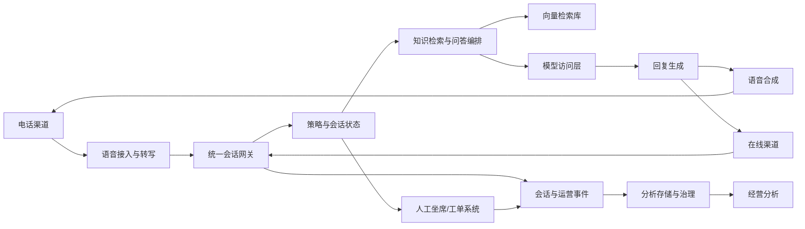

## Requirements gap check

Known facts
- 目标：构建支持电话和在线渠道的智能客服。
- 需要能力：语音识别、语音合成、知识问答、转人工、经营分析。

Architecture-changing gaps
- 未给出部署 location、数据驻留、合规边界、身份体系、现有客服/CRM/工单系统。
- 未给出 capacity target、service target、RTO/RPO、录音与会话留存策略、人工坐席系统接口。
- 未给出知识库来源、更新频率、权限过滤要求、质检与分析指标口径。
- 火山引擎具体产品可用性、commercial terms、容量与服务目标均为 runtime verification required。

Assumptions if unanswered
- Assumption: 先采用托管 AI 与检索增强架构，应用侧保留编排、审计、降级与人工接管控制。Switch condition: 如果要求完全自建编排或强隔离，改为应用自管工作流加模型访问层。
- Assumption: 在线渠道走 Web/API，电话渠道由呼叫平台或现有 CTI 接入。Switch condition: 如果必须新建完整呼叫中心，需补充号码、坐席、录音、外呼与监管要求。
- Assumption: 经营分析以会话事件、质检标签、转人工、解决状态和客户满意反馈为主。Switch condition: 如果要实时运营大屏，增加流式处理链路。

## Executive summary

推荐采用“渠道接入层 + 语音处理 + AI 问答编排 + 知识检索 + 人工接管 + 事件分析”的分层架构。电话音频先转文本，在线消息直接进入统一会话网关；网关调用知识问答链路，低置信、敏感、超时或用户要求时转人工；全链路事件进入分析数据层。

本方案是条件性设计，不是生产上线授权。核心阻塞项是部署 location、capacity target、service target、合规、坐席系统接口和官方运行时校验。

## Known facts, assumptions, and open items

Facts
- 业务需要覆盖电话与在线客服。
- 需要 ASR、TTS、知识问答、人工接管和经营分析闭环。

Assumptions
- 使用火山方舟/豆包大模型作为模型访问与生成能力候选；应用侧负责会话状态、工具调用、策略和审计。
- 使用 VikingDB 向量数据库承载知识检索索引；原始知识、录音、转写文本和分析明细分层存储。
- 使用 DataLeap 或湖仓分析服务承载经营分析开发、治理和查询。
- 使用 VPC、IAM、KMS、WAF/负载均衡构建网络与身份边界。

Open items
- deployment location 与数据驻留要求。
- 电话平台、在线渠道、CRM、工单和坐席系统接口。
- capacity target、service target、RTO/RPO、留存与删除策略。
- 知识权限模型、敏感信息处理、质检口径。
- 所有产品可用性、commercial terms、容量边界均 runtime verification required。

```yaml
routing:
  scenario_labels: [AI_AGENT, BATCH_DATA, REALTIME_DATA, DATABASE, STORAGE, MEDIA]
  quality_labels: [LOW_LATENCY, HIGH_AVAILABILITY]
  constraint_labels: [PRIVATE_NETWORK, DATA_RESIDENCY]
  product_families: [AI and agent, data and analytics, database and storage, networking and security, media and edge]
  roles: [requirements-analyst, product-researcher, domain-architect, security-reliability-reviewer]
  execution_mode: serial
  rationale: [multi-channel intelligent-service workload, voice and text AI path, knowledge retrieval, analytics pipeline, public ingress and private data boundary]
```

## Architecture decisions

| Decision | Rationale | Alternative | Reason not selected |
| --- | --- | --- | --- |
| 统一会话网关承接电话转写文本和在线消息 | 统一鉴权、限流、会话状态、路由、审计与降级 | 各渠道各自直连模型 | 难以统一转人工、质检和分析口径 |
| 应用侧编排问答链路 | 便于控制检索、提示词、工具、人工审批和回滚 | 完全托管智能体 | 生产治理、权限过滤和坐席接管边界未明确 |
| RAG 知识问答 | 企业知识可更新、可溯源、可按权限过滤 | 仅依赖通用模型 | 无法保证企业知识一致性 |
| 事件驱动分析层 | 会话、转人工、质检和结果事件可复盘 | 直接查业务库报表 | 容易影响交易链路且治理弱 |
| 人工接管作为显式状态机 | 便于处理排队、上下文移交、回流与评价 | 简单按钮跳转坐席 | 难以保证上下文完整和运营分析 |

## Logical architecture



## Deployment topology

- deployment location: unresolved；需按用户、数据驻留和合规要求 runtime verification required。
- 网络：公网入口经 WAF/负载均衡进入 VPC；应用服务、数据库、对象存储访问路径保持私网优先。
- 分区：生产环境至少拆分接入、应用、数据、管理子网；可用区布局待 service target 与产品能力 runtime verification required。
- 灾备关系：先做同城多副本与备份恢复演练；跨地恢复只有在 RTO/RPO 明确后设计。
- 出入口：在线渠道走 HTTPS/API；电话渠道经呼叫平台或 CTI 网关；模型、检索、存储和分析调用由服务身份授权。

## End-to-end data flow

1. 电话咨询，同步音频进入语音接入层；ASR 输出文本，会话网关写入会话状态；失败时提示重试或转人工。
2. 在线咨询，同步 HTTPS/API 消息进入会话网关；网关做身份、渠道、会话和策略校验；失败时返回可重试错误。
3. 知识问答，同步调用检索链路；查询向量库和权限元数据，拼接上下文后调用模型访问层；检索为空或低置信时转人工。
4. 回复输出，在线渠道直接返回文本/富文本；电话渠道调用 TTS 生成语音播放；TTS 失败时降级为人工或短信/在线链接。
5. 转人工，策略引擎创建接管事件并携带摘要、历史、客户身份和推荐标签；坐席处理结果回写会话。
6. 知识更新，文档进入对象存储和治理流程；清洗、切分、向量化后发布索引版本；失败任务进入重试和人工复核。
7. 经营分析，会话事件异步进入分析层；生成转人工原因、解决情况、热点问题、质检标签和渠道表现报表。
8. 审计与安全，关键请求记录最小必要日志；敏感字段脱敏或加密；访问、检索、模型调用和人工查看均留痕。

## Volcengine product mapping

| Architecture capability | Recommended Volcengine product | Why it fits | Alternative | Switch condition | Evidence |
| --- | --- | --- | --- | --- | --- |
| 模型访问与问答生成 | 火山方舟 + 豆包大模型 | 托管模型访问、推理、评测和应用开发支撑适合客服问答链路 | 应用直连其他模型服务 | 如果模型能力、数据处理条款或部署控制不满足要求则替换 | https://www.volcengine.com/docs/82379/66619f8df281250274ef4f88?lang=zh Retrieved: 2026-08-09; https://www.volcengine.com/product/doubao-dy Retrieved: 2026-08-09 |
| 企业知识检索 | VikingDB 向量数据库 | 适合语义检索、相似度召回和 RAG grounding | 关系库全文检索或外部检索服务 | 如果权限过滤、嵌入兼容或更新延迟不满足要求则替换 | https://www.volcengine.com/sem Retrieved: 2026-08-09 |
| 智能体/流程编排候选 | 扣子或 HiAgent | 可作为托管智能体和企业知识应用建设候选 | 应用自管编排 | 如果接管、工具审批、隔离或连接器不满足生产治理则自管 | https://www.volcengine.com/sem Retrieved: 2026-08-09 |
| 会话元数据与工单状态 | 云数据库 MySQL 版或 PostgreSQL 版 | 适合事务型会话、客户、工单、状态流转数据 | 文档数据库 MongoDB 版 | 如果领域对象更偏文档且查询模式匹配则切换 | https://www.volcengine.com/docs/6313 Retrieved: 2026-08-09; https://www.volcengine.com/docs/6438 Retrieved: 2026-08-09 |
| 录音、转写、知识原文与分析明细 | 对象存储 TOS | 适合非结构化对象、数据湖落地和生命周期管理 | 弹性文件存储 | 如果应用必须共享挂载文件语义则切换 | https://www.volcengine.com/docs/6349 Retrieved: 2026-08-09 |
| 经营分析治理 | DataLeap + LAS 候选 | 支持数据开发、治理和湖仓分析形态 | E-MapReduce | 如果需要 Hadoop/Spark 集群级控制或兼容既有生态则切换 | https://www.volcengine.com/docs/6260 Retrieved: 2026-08-09; https://www.volcengine.com/docs/86403/1829870?lang=zh Retrieved: 2026-08-09 |
| 私网与入口 | VPC + 负载均衡 + WAF | 支持隔离网络、入口分发和 Web/API 防护 | 仅公网服务入口 | 如果无公网客服入口且仅内网使用，可收窄入口形态 | https://www.volcengine.com/docs/6401 Retrieved: 2026-08-09; https://www.volcengine.com/docs/6406 Retrieved: 2026-08-09; https://www.volcengine.com/docs/6511 Retrieved: 2026-08-09 |
| 身份与密钥 | IAM + KMS | 支持集中授权和密钥治理 | 应用内自管密钥 | 如果有外部 KMS 或合规指定密钥体系则调整 | https://www.volcengine.com/docs/6257/64959?lang=zh Retrieved: 2026-08-09; https://www.volcengine.com/product/kms Retrieved: 2026-08-09 |
| 实时语音会话候选 | veRTC | 可作为互动音视频链路候选；电话 CTI 适配仍需确认 | 现有呼叫中心/运营商平台 | 如果电话链路由既有 CTI 承担，则 veRTC 只用于在线音视频扩展 | https://www.volcengine.com/docs/6348 Retrieved: 2026-08-09 |

## Non-functional design

- Capacity and elasticity: capacity target 未知；按渠道、峰值并发、平均会话时长、语音时长、知识库规模和分析刷新目标做压测，当前 runtime verification required。
- Availability: 入口、会话服务、人工接管和数据写入需多实例；模型或检索超时必须降级到人工或排队。
- RTO/RPO: 未定义；上线前必须给会话状态、工单、知识库、录音和分析数据分别设定恢复目标。
- Security and compliance: IAM 最小权限、KMS 管理密钥、WAF 防护公网 API、日志脱敏、知识权限过滤、坐席查看审计。
- Observability: 采集渠道成功率、ASR/TTS错误、检索命中、模型调用、转人工原因、坐席处理、分析任务状态。
- Performance: 电话链路优先优化端到端响应；在线链路优先优化首字回复和检索命中；所有阈值 runtime verification required。
- Cost: 主要驱动为语音处理时长、模型调用、向量索引、对象存储、分析计算和公网入口流量；commercial terms runtime verification required。

Serial role pass
- Security/reliability review: 最大风险是敏感会话数据、知识越权、模型幻觉、电话链路中断和人工接管失败。
- FinOps review: 不做固定成本承诺，先以 PoC 计量埋点获得真实用量，再决定模型、索引、分析刷新和留存策略。

## Implementation roadmap

PoC
- 接入一个电话入口模拟器和一个在线入口。
- 建立小规模知识库、RAG 问答、人工接管状态机和基础事件表。
- Acceptance: 能完成咨询、回答、失败降级、人工移交和事件回放。

Minimum production
- 打通真实渠道、坐席/工单系统、身份认证、权限过滤、日志脱敏、备份恢复演练。
- 建立知识发布流程、评测集、灰度和回滚。
- Acceptance: 核心流程有监控、审计、降级、恢复演练记录和运营报表。

Scale
- 按真实 capacity target 扩展入口、会话服务、检索索引、分析链路和多环境发布。
- 引入更细的质检、意图分类、热点问题、坐席绩效和知识缺口分析。
- Acceptance: 峰值演练、故障演练、成本归因和安全复核均通过。

## Risk and validation plan

| Risk | Probability | Impact | Mitigation | Owner | Validation method |
| --- | --- | --- | --- | --- | --- |
| 知识回答不准确 | Medium | High | 评测集、引用、低置信转人工、人工复核 | AI负责人 | 离线评测与真实会话抽检 |
| 知识权限越权 | Medium | High | 检索前后双重鉴权、字段脱敏、审计 | 安全负责人 | 权限用例和渗透测试 |
| 电话链路体验差 | Medium | High | ASR/TTS超时降级、人工接管、链路追踪 | 语音负责人 | 端到端压测和通话回放 |
| 人工接管上下文丢失 | Medium | High | 标准移交摘要、状态机、工单回写 | 客服平台负责人 | 接管演练 |
| 分析口径不一致 | Medium | Medium | 事件字典、数据血缘、质量规则 | 数据负责人 | 对账与报表验收 |
| commercial terms 超预期 | Medium | Medium | 用量计量、分层留存、模型与索引策略调优 | FinOps | PoC 用量账单复盘 |
| 产品能力不满足 | Medium | High | runtime verification required，保留替代方案 | 架构负责人 | 官方控制台和文档核验 |

## Official evidence and freshness

- 火山方舟：托管模型访问、推理、评测和应用开发支撑候选。https://www.volcengine.com/docs/82379/66619f8df281250274ef4f88?lang=zh Retrieved: 2026-08-09
- 豆包大模型：模型能力候选入口。https://www.volcengine.com/product/doubao-dy Retrieved: 2026-08-09
- AI 云与智能体入口：扣子、HiAgent、VikingDB 候选发现入口。https://www.volcengine.com/sem Retrieved: 2026-08-09
- DataLeap：数据开发与治理候选。https://www.volcengine.com/docs/6260 Retrieved: 2026-08-09
- 文档中心/LAS/E-MapReduce 发现入口。https://www.volcengine.com/docs/86403/1829870?lang=zh Retrieved: 2026-08-09
- VPC、负载均衡、IAM、KMS、WAF、TOS、关系数据库、veRTC 均需针对目标账号 runtime verification required；本回答不声明动态数值、commercial terms、capacity target 或 service target。

## Completeness score

Requirements: 1
Architecture: 1
Security: 1
Reliability: 1
Cost: 1
Evidence: 1
Production readiness: NOT READY

Blocker: deployment location、capacity target、service target、RTO/RPO、数据治理边界、电话/坐席系统接口和所有运行时产品条件仍未确认。

## Forward observations
- Requirements gap list before solution: PASS
- Only architecture-changing questions: PASS
- Facts separated from assumptions: PASS
- Product alternatives and switch conditions: PASS
- Security, reliability, observability, and cost covered: PASS
- Official evidence and retrieval dates: PASS
- Production-readiness claim appropriately bounded: PASS
