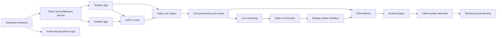

## Requirements gap check
Known facts
- Goal: a national education live-class and replay platform.
- Required capabilities: student-teacher interaction, live transcoding, content review, weak-network experience protection, and replay.

Architecture-changing gaps
- capacity target, peak profile, class duration, viewers per class, and interactive seats are unknown.
- Moderation scope is unknown for live audio/video, replay, covers, comments, courseware, and manual review.
- Data governance, retention, deletion, minor protection, and audit evidence requirements are unknown.
- deployment location, commercial terms, service target, SDK/platform fit, and media protocol fit need runtime verification required.

Assumptions if unanswered
- Assumption: live teaching is one teacher or small-group interaction with larger one-to-many viewing. Switch condition: if most students need continuous bidirectional media, make veRTC the primary classroom path.
- Assumption: replay is generated from live recording and published after review. Switch condition: if replay needs editing or packaging, add a dedicated media production workflow.
- Assumption: business systems own identity, course entitlement, class state, review workflow, and operations. Switch condition: if Volcengine-native enterprise live workflows own these, reduce custom backend scope.

## Executive summary
Use a split media architecture: veRTC for low-latency interaction, Video Live for one-to-many class broadcast and live processing, Video on Demand for replay lifecycle, CDN for national playback delivery, and managed review controls before or during publication. Business services remain responsible for class orchestration, authorization, entitlements, audit trails, and operational review state.

This is a bounded proposal, not a production authorization. Open capacity, governance, service target, deployment location, and commercial terms keep readiness at NOT READY.

## Known facts, assumptions, and open items
Known facts:
- The workload is an education live and replay platform for national users.
- Required media features include interaction, live transcoding, content review, weak-network handling, and replay.

Assumptions:
- Teachers publish media; students mostly view and sometimes join interaction.
- Playback authorization is controlled by the education backend.
- Replay is not publicly released until review passes.
- Weak-network protection combines SDK behavior, adaptive playback, CDN delivery, and telemetry.

Open items:
- capacity target, course schedule peak shape, viewer mix, and interactive-seat model.
- Moderation categories, escalation policy, manual review staffing, and evidence retention.
- Data classification, retention/deletion rules, account boundary, and deployment location.
- service target, recovery objective, incident ownership, and operational runbooks.
- runtime verification required for SDK platforms, media protocols, processing templates, commercial terms, and service compatibility.

```yaml
routing:
  scenario_labels: [MEDIA, EDGE, CLOUD_NATIVE, STORAGE]
  quality_labels: [LOW_LATENCY, HIGH_THROUGHPUT, HIGH_AVAILABILITY, DISASTER_RECOVERY]
  constraint_labels: [PRIVATE_NETWORK, DATA_RESIDENCY, REGULATED, COST_SENSITIVE]
  product_families: [media-edge, networking-security, database-storage, compute-cloud-native]
  roles: [requirements-analyst, product-researcher, domain-architect, security-reliability-reviewer, finops-reviewer]
  execution_mode: serial
  rationale:
    - MEDIA covers live, RTC, transcoding, moderation, and replay.
    - EDGE covers national delivery and weak-network playback quality.
    - REGULATED, DATA_RESIDENCY, and DISASTER_RECOVERY stay open because education content, user data, and replay retention are unresolved.
```

## Architecture decisions
| Decision | Rationale | Alternative | Reason not selected |
| --- | --- | --- | --- |
| Split interaction from broadcast delivery | veRTC fits real-time interaction while Video Live fits one-to-many viewing | veRTC-only classroom | May overfit large passive viewing and cost model is unverified |
| Use VOD for replay lifecycle | Replay needs asset management, processing, distribution, and playback controls | TOS plus custom processors | Higher custom workflow and operations burden |
| Place review controls before replay release and during live operations | Live risk and replay publishing risk happen at different times | Replay-only review | Does not control live-session violations |
| Deliver playback through CDN | National playback benefits from edge caching and origin protection | Direct origin delivery | Higher origin pressure and weaker user proximity controls |
| Keep business APIs private behind controlled ingress | Identity, entitlements, callbacks, and review actions need clear boundaries | Public backend services | Larger exposed surface and harder audit control |

## Logical architecture


## Deployment topology
- deployment location: unresolved; runtime verification required before production placement.
- Failure domains: separate business API, media callback workers, review console, database, cache, and observability components where supported.
- Network: private network per environment with public ingress only through DNS, CDN, WAF, or load balancing paths.
- Subnets: ingress, application, data, observability, and management tiers with least-required routing.
- Recovery: metadata and audit stores need backup and restore drills; replay assets need lifecycle, replication, deletion, and restore validation after governance is confirmed.
- Ingress: business API via WAF and load balancing; media playback via CDN; RTC/live ingest via managed media endpoints after runtime verification required.

## End-to-end data flow
1. Class entry is synchronous over secure HTTP: user identity, course entitlement, and role are checked; failure records an audit event and returns a safe denial.
2. Teacher starts class through SDK signaling and live ingest: audio/video stream enters veRTC and/or Video Live; failure triggers reconnect and audio-only fallback where supported.
3. Student watches live through signed playback authorization: media streams from CDN/live delivery; weak-network events trigger adaptive playback and telemetry upload.
4. Student joins interaction through a controlled room token: real-time media flows through veRTC; failure leaves the student in viewer mode.
5. Live transcoding is asynchronous: stream variants are produced for device/network adaptation; processing failure alerts operations and falls back to available stream output.
6. Content review runs on live operations and replay publish gates: uncertain results enter a manual review queue; rejected content is blocked or taken down.
7. Recording and replay creation are asynchronous: live recording enters VOD workflow; replay metadata is stored by the business backend.
8. Replay playback is synchronous for entitlement and asynchronous for media delivery: expired or revoked tokens block access; playback errors emit quality telemetry.

## Volcengine product mapping
| Architecture capability | Recommended Volcengine product | Why it fits | Alternative | Switch condition | Evidence |
| --- | --- | --- | --- | --- | --- |
| Real-time interaction | 实时音视频 veRTC | Fits interactive audio/video rooms, SDK integration, room/session control, and quality monitoring. | Video Live only | If interaction is removed or reduced to one-way broadcast. | https://www.volcengine.com/docs/6348 Retrieved: 2026-08-09 |
| Live broadcast and transcoding path | 视频直播 | Fits live ingest, live processing, distribution, playback, recording, and monitoring. | veRTC-only classroom | If every attendee needs bidirectional real-time media. | https://www.volcengine.com/docs/6469 Retrieved: 2026-08-09 |
| Replay lifecycle | 视频点播 | Fits recorded-media asset management, processing, distribution, playback, and quality monitoring. | 对象存储 TOS plus custom workflow | If managed VOD processing or playback controls do not fit after runtime verification required. | https://www.volcengine.com/docs/4 Retrieved: 2026-08-09 |
| National playback delivery | 内容分发网络 CDN | Fits cacheable media delivery, origin fetch, domain management, and cache control. | Direct origin playback | If content is not cacheable or cache-key governance fails. | https://www.volcengine.com/docs/6454 Retrieved: 2026-08-09 |
| Live/replay inspection workflow | 企业直播直播质检 | Fits live stream inspection, machine/manual review workflow, realtime analysis, and alerting discovery. | Custom moderation service | If moderation categories, callbacks, or workflow fit are not verified. | https://www.volcengine.com/docs/3019/2024033 Retrieved: 2026-08-09 |
| Cover/image review | veImageX 智能审核 | Fits managed image review and review-task workflow for image-centric assets. | Business-owned image review | If only video/audio require review. | https://www.volcengine.com/docs/508/1160396 Retrieved: 2026-08-09 |
| Private service boundary | 私有网络 | Fits isolated virtual networking, subnets, routes, security groups, and access control. | Public-only backend | If no private workloads remain, unlikely for this platform. | https://www.volcengine.com/docs/6401 Retrieved: 2026-08-09 |
| Public API protection | 负载均衡 + Web应用防火墙 | Fits backend traffic distribution, health checking, web/API inspection, and security logging. | CDN-only API entry | If APIs are private-only or another gateway is mandated. | https://www.volcengine.com/docs/6406 Retrieved: 2026-08-09; https://www.volcengine.com/docs/6511 Retrieved: 2026-08-09 |
| Identity and key governance | 访问控制 IAM + 密钥管理系统 | Fits policy authorization, temporary credentials, managed key custody, and cryptographic operations. | Application-only credentials | If key ownership or service integration fails runtime verification required. | https://www.volcengine.com/docs/6257/64959?lang=zh Retrieved: 2026-08-09; https://www.volcengine.com/product/kms Retrieved: 2026-08-09 |
| Replay object storage option | 对象存储 TOS | Fits object semantics, bucket/object management, lifecycle, and access control for durable artifacts. | VOD-managed media store only | If VOD fully owns replay storage and lifecycle. | https://www.volcengine.com/docs/6349 Retrieved: 2026-08-09 |

## Non-functional design
- Capacity and elasticity: define class concurrency, viewers per class, interactive seats, bitrate ladder, recording volume, callback backlog, and review queue as capacity target.
- Availability and recovery: remove single points in business APIs, token issuance, callbacks, review queue, metadata storage, and observability; service target and recovery objective remain open.
- Security and compliance: use least-privilege IAM, short-lived media tokens, signed playback, WAF on public APIs, private backend paths, KMS-backed encryption where supported, and immutable audit logs.
- Observability: track class start success, room join success, publish failures, startup time, rebuffering, interaction delay, transcoding errors, recording completion, review queue age, and playback errors.
- Performance: use pre-class device checks, adaptive playback, reconnection, audio fallback, CDN delivery, and client telemetry to tune weak-network behavior.
- Cost: major drivers are RTC duration, live duration, transcoding, recording, replay storage, CDN traffic, moderation volume, logs, and retention; no estimate is valid before commercial terms and usage data are verified.

## Implementation roadmap
PoC:
- Build teacher publish, student watch, one veRTC interaction path, one live-to-replay path, basic review callback, and a quality dashboard.
- Acceptance: one representative class completes from start through replay publication with observable failures.

Minimum production:
- Add IAM roles, WAF, signed playback, audit trails, manual review console, callback idempotency, backup/restore runbooks, and incident procedures.
- Acceptance: access control, review gate, replay publishing, failure recovery, and audit evidence pass controlled tests.

Scale phase:
- Add traffic steering, hot-course cache tuning, capacity testing, automated quality analysis, cost allocation tags, and recovery exercises.
- Acceptance: capacity target and service target are met after runtime verification required.

## Risk and validation plan
| Risk | Probability | Impact | Mitigation | Owner | Validation method |
| --- | --- | --- | --- | --- | --- |
| Weak network disrupts live class | Medium | High | adaptive playback, reconnect, audio fallback, telemetry | Client lead | device and network impairment tests |
| Live violations are missed | Medium | High | live inspection, manual escalation, replay gate | Trust and safety | red-team moderation tests |
| Replay callback loss corrupts publish state | Medium | Medium | idempotent callbacks, retry queue, reconciliation | Backend lead | fault injection |
| Data governance is under-specified | Medium | High | classify data, define retention/deletion, confirm deployment location | Security lead | compliance review |
| Cost overrun from popular replays | Medium | Medium | cache policy, lifecycle rules, course-level cost allocation | FinOps | billing dry run after commercial verification |
| Managed service fit mismatch | Medium | High | verify SDKs, protocols, templates, callbacks, and account support | Architect | console and documentation validation |

## Official evidence and freshness
Evidence level: A-level official Volcengine discovery sources are cited in the product mapping table with `Retrieved: 2026-08-09`.

Dynamic or account-specific facts not asserted: deployment location, commercial terms, service target, capacity target, endpoint fit, SDK platform support, media protocols, codec/container support, processing templates, review categories, callback behavior, retention behavior, and service-to-service compatibility. These require runtime verification required before production planning.

## Completeness score
Requirements: 1
Architecture: 1
Security: 1
Reliability: 1
Cost: 1
Evidence: 1
Production readiness: NOT READY

Blocker: capacity target, deployment location, service target, data governance, moderation policy, recovery objective, and commercial terms remain unresolved.

## Forward observations
- Requirements gap list before solution: PASS
- Only architecture-changing questions: PASS
- Facts separated from assumptions: PASS
- Product alternatives and switch conditions: PASS
- Security, reliability, observability, and cost covered: PASS
- Official evidence and retrieval dates: PASS
- Production-readiness claim appropriately bounded: PASS
