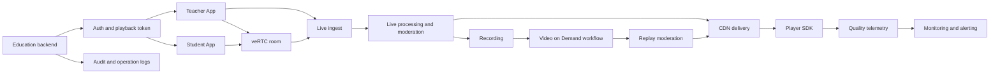

## Requirements gap check
Known facts
- 目标：面向全国用户的教育直播与回放平台。
- 必需能力：连麦、直播转码、内容审核、弱网体验保障、直播回放。

Architecture-changing gaps
- 用户规模、并发课堂规模、互动人数、课程时长、峰值时段未知。
- 内容审核范围未知：音频、视频、封面、评论、课件、回放成片是否都需审核。
- 合规边界、数据分级、留存周期、未成年人保护要求未知。
- deployment location、service target、capacity target、commercial terms 均需 runtime verification required。

Assumptions if unanswered
- Assumption: 采用托管媒体服务优先，业务系统只承载课堂编排、鉴权、课表、订单、运营后台。Switch condition: 如需自研媒体链路，改为云原生媒体网关加自建处理流水线。
- Assumption: 连麦用于教师与少量学生互动，大班观看走直播分发。Switch condition: 如全员实时互动，主链路改为 veRTC 房间模式。
- Assumption: 回放来自直播录制并进入点播处理。Switch condition: 如回放需复杂剪辑生产，增加独立媒资生产工作流。

## Executive summary
建议采用“veRTC 连麦 + 视频直播大班分发 + 视频点播回放 + 内容安全审核 + CDN 加速 + 私有网络与安全边界”的组合。实时互动与大规模观看拆成两条链路：互动课堂走 veRTC，旁路或主讲流进入直播链路，录制后进入点播链路供回放。

本方案是有条件设计，不是上线授权。deployment location、commercial terms、service target、capacity target、终端 SDK 支持、协议兼容、审核能力边界均需 runtime verification required。

routing:
```yaml
scenario_labels: [MEDIA, EDGE, CLOUD_NATIVE, STORAGE]
quality_labels: [LOW_LATENCY, HIGH_THROUGHPUT, HIGH_AVAILABILITY, DISASTER_RECOVERY]
constraint_labels: [DATA_RESIDENCY, REGULATED, COST_SENSITIVE]
product_families: [media-edge, networking-security, database-storage, compute-cloud-native]
roles: [requirements-analyst, product-researcher, domain-architect, security-reliability-reviewer, finops-reviewer]
execution_mode: serial
rationale:
  - MEDIA: live, replay, transcoding, RTC are core flows.
  - EDGE: national playback and weak-network experience need edge delivery.
  - REGULATED: education content and user data require audit and governance.
```

## Known facts, assumptions, and open items
Known facts:
- 全国用户教育直播与回放。
- 需要连麦、转码、内容审核、弱网体验保障。

Assumptions:
- 课堂身份包括教师、助教、学生、运营审核员。
- 直播观看以一对多为主，连麦是局部互动。
- 回放需要鉴权、防盗链、审核后发布。
- 弱网保障以端侧 SDK、直播分发、播放器策略、质量监控共同实现。

Open items:
- capacity target and peak profile。
- deployment location and data governance boundary。
- service target and recovery objective。
- content moderation policy and human review workflow。
- retention, deletion, watermarking, copyright controls。
- runtime verification required for all selected service limits and commercial terms。

## Architecture decisions
| Decision | Rationale | Alternative | Reason not selected |
| --- | --- | --- | --- |
| 连麦使用 veRTC，观看使用视频直播 | 区分实时互动和大班分发，降低课堂广播链路复杂度 | 全部使用 veRTC | 对大规模旁听不一定经济或必要 |
| 回放使用视频点播承载 | 录制、处理、媒资、播放形成独立生命周期 | 对象存储直出 | 需要自建转码、封面、播放、安全与质量能力 |
| 热门课程通过 CDN 分发 | 全国访问需要边缘缓存与回源控制 | 仅源站播放 | 源站压力与跨地访问体验风险更高 |
| 内容审核放在发布前与直播中双点 | 直播风险和回放风险不同 | 只做回放审核 | 直播过程违规无法及时处置 |
| 业务服务运行在私有网络内 | 课表、鉴权、审核后台与媒资回调需要隔离 | 全公网部署 | 暴露面更大，审计和访问控制更难 |
| 质量监控覆盖端、流、转码、播放 | 弱网体验需要可观测闭环 | 仅采集服务端日志 | 无法定位终端网络和播放器问题 |

## Logical architecture


## Deployment topology
- deployment location: unresolved; runtime verification required before site selection.
- Fault-domain plan: business backend, databases, cache, media callbacks, and audit services should be split across independent failure domains where supported.
- Network: one private network per environment; public ingress only through DNS, CDN, WAF or load balancer paths; backend services stay private.
- Subnets: public ingress subnet, application subnet, data subnet, observability subnet, management subnet.
- Disaster recovery: metadata and audit data require cross-site backup strategy; media assets require lifecycle, replication, and restore drills after deployment location is confirmed.
- Ingress: app API through WAF and load balancing; media playback through CDN; RTC and live ingest through selected managed media endpoints.

## End-to-end data flow
1. Login and class entry: synchronous HTTPS; user identity, course entitlement, classroom role; backend issues short-lived access token; failure returns retryable user state and audit event.
2. Teacher starts class: synchronous SDK signaling plus live ingest; audio/video stream enters veRTC and live workflow; failure triggers reconnection and fallback to audio-only policy.
3. Student watches live: HTTPS obtains play authorization, player connects to CDN/live path; media data is streamed; weak network triggers adaptive playback and telemetry upload.
4. Student joins interaction: synchronous room join request, real-time media over SDK path; if join fails, user remains viewer and receives state message.
5. Transcoding: asynchronous live processing; stream variants are produced for device and network adaptation; failures alert operations and can fall back to available stream path.
6. Moderation: live moderation is near-real-time operational control; replay moderation is asynchronous before publishing; uncertain content enters human review queue.
7. Recording to replay: asynchronous recording output enters VOD workflow; metadata stored in business database; media stored in managed media storage or object storage.
8. Replay playback: synchronous entitlement check, signed playback URL issued, media delivered via CDN; expired token or revoked course blocks playback.
9. Observability: clients, backend, live, RTC, processing, CDN and VOD emit logs or metrics; alerts route to operations owner.

## Volcengine product mapping
| Architecture capability | Recommended Volcengine product | Why it fits | Alternative | Switch condition | Evidence |
| --- | --- | --- | --- | --- | --- |
| 连麦互动 | 实时音视频 veRTC | Supports real-time audio/video communication, client SDK integration, room/session control, and quality monitoring. | 视频直播互动方案 | If interaction is only teacher broadcast with no real-time student media. | https://www.volcengine.com/docs/6348 Retrieved: 2026-08-09 |
| 直播分发 | 视频直播 | Supports live ingest, live processing, distribution, playback, recording and monitoring. | veRTC-only classroom | If every participant requires real-time bidirectional media. | https://www.volcengine.com/docs/6469 Retrieved: 2026-08-09 |
| 回放媒资 | 视频点播 | Supports upload, asset management, media processing, on-demand distribution, playback and quality monitoring. | TOS plus self-built workflow | If managed VOD processing is unsuitable after runtime verification required. | https://www.volcengine.com/docs/4 Retrieved: 2026-08-09 |
| 全国播放加速 | 内容分发网络 CDN | Supports edge content caching, origin fetch, domain and cache control for cacheable media. | Direct origin delivery | If content is not cacheable or cache policy cannot meet governance needs. | https://www.volcengine.com/docs/6454 Retrieved: 2026-08-09 |
| Traffic steering | TrafficRoute DNS 套件 | Supports DNS management, traffic steering and health-aware routing. | Single DNS endpoint | If single managed media endpoint is sufficient. | https://www.volcengine.com/docs/6758 Retrieved: 2026-08-09 |
| Network isolation | 私有网络 | Supports isolated virtual networking, subnets, routes and security controls. | Flat public network | If no private workloads exist, which is unlikely for this platform. | https://www.volcengine.com/docs/6401 Retrieved: 2026-08-09 |
| Web/API ingress | 负载均衡 + Web应用防火墙 | Load balancing supports backend distribution and health checks; WAF supports web/API inspection and security logging. | CDN-only web ingress | If APIs are not public or are served by another gateway. | https://www.volcengine.com/docs/6406 Retrieved: 2026-08-09; https://www.volcengine.com/docs/6511 Retrieved: 2026-08-09 |
| Identity and keys | 访问控制 IAM + 密钥管理系统 | IAM supports policy authorization; KMS supports managed key custody and cryptographic operations. | Application-only credentials | If service integration or key ownership model fails runtime verification required. | https://www.volcengine.com/docs/6257/64959?lang=zh Retrieved: 2026-08-09; https://www.volcengine.com/product/kms Retrieved: 2026-08-09 |

## Non-functional design
- Capacity and elasticity: define classroom concurrency, viewers per class, interactive seats, stream profiles, recording workload, and callback backlog as capacity target; runtime verification required.
- Availability and recovery: split critical services across independent failure domains; define service target and recovery objective before production.
- Security and compliance: enforce IAM least privilege, short-lived playback tokens, WAF on public APIs, signed media access, audit logs, encryption with managed keys where supported, and moderation evidence retention.
- Observability: track publish success, join success, startup time, rebuffering, interaction delay, transcoding failure, recording completion, moderation queue age, playback errors, and CDN/origin health.
- Performance: use adaptive encoding, player retry, pre-class device check, audio fallback, CDN distribution, and client telemetry to improve weak-network behavior.
- Cost: primary drivers are live duration, RTC interaction duration, transcoding, recording storage, replay traffic, moderation workload, and log retention; commercial terms require runtime verification required.

Serial role pass review:
- Security/reliability: design is plausible but blocked by unresolved data governance, service target, recovery objective, and moderation rules.
- FinOps: no estimate should be produced until traffic mix, retention, replay ratio, and commercial terms are verified.

## Implementation roadmap
PoC:
- Build one teacher app, one student app, veRTC room, live ingest, replay generation, basic moderation callback, and telemetry dashboard.
- Acceptance: full class lifecycle works on representative devices; failure events are observable.

Minimum production:
- Add IAM roles, WAF, signed playback, audit logs, review console, retry/idempotency for callbacks, backup and restore runbooks, and incident procedures.
- Acceptance: access control, moderation workflow, replay publishing, and recovery drills pass.

Scale phase:
- Add multi-site traffic steering, hot-course delivery tuning, automated quality analysis, capacity test harness, operations dashboards, and cost allocation tags.
- Acceptance: capacity target and service target are met in controlled load tests after runtime verification required.

## Risk and validation plan
| Risk | Probability | Impact | Mitigation | Owner | Validation method |
| --- | --- | --- | --- | --- | --- |
| Weak network causes class interruption | Medium | High | adaptive playback, reconnection, audio fallback, telemetry | Client lead | field test and synthetic network test |
| Moderation misses live violations | Medium | High | live detection, human escalation, replay gate | Trust and safety | red-team content test |
| Replay publish callback loss | Medium | Medium | idempotent callbacks, retry queue, reconciliation job | Backend lead | fault injection |
| Unclear data governance | Medium | High | classify data, define retention, confirm deployment location | Security lead | compliance review |
| Cost overrun from replay traffic | Medium | Medium | cache policy, lifecycle rules, per-course cost attribution | FinOps | billing dry run after commercial terms check |
| Managed service capability mismatch | Medium | High | runtime verification required for SDK, protocol, processing and account support | Architect | vendor console and doc validation |

## Official evidence and freshness
Evidence used is official Volcengine discovery documentation, cited in the product mapping table with `Retrieved: 2026-08-09`.

Dynamic or account-specific facts not asserted: deployment location, commercial terms, service target, capacity target, protocol edge cases, SDK platform support, processing templates, retention behavior, moderation coverage, and service-to-service compatibility. All require runtime verification required before production planning.

## Completeness score
Requirements: 1
Architecture: 1
Security: 1
Reliability: 1
Cost: 1
Evidence: 1
Production readiness: NOT READY

Blocker: architecture-changing capacity target, deployment location, service target, moderation policy, data governance, and commercial terms remain unresolved.

## Forward observations
- Requirements gap list before solution: PASS
- Only architecture-changing questions: PASS
- Facts separated from assumptions: PASS
- Product alternatives and switch conditions: PASS
- Security, reliability, observability, and cost covered: PASS
- Official evidence and retrieval dates: PASS
- Production-readiness claim appropriately bounded: PASS
