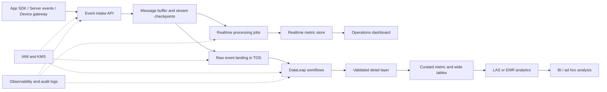

## Requirements gap check
Known facts
- 需要汇总 App 埋点、交易事件、设备事件。
- 需要支持分钟级运营看板。
- 需要支持次日复杂分析。

Architecture-changing gaps
- 数据敏感级别、合规边界、保留周期未给出。
- 峰值吞吐、事件大小、乱序容忍、重放窗口未给出。
- 看板查询并发、指标口径、明细追溯需求未给出。
- 目标 deployment location、灾备目标、运维团队边界未给出。

Assumptions if unanswered
- Assumption: 三类事件均可异步采集，允许最终一致。Switch condition: 如交易链路要求同步确认，则需增加交易系统内的事务确认与补偿设计。
- Assumption: 明细原始数据长期落对象存储，实时层只保存聚合或热数据。Switch condition: 如看板需任意明细交互查询，则需增强分析服务层。
- Assumption: 暂不声明具体商业条款、服务目标、容量目标和可用 deployment location，均为 runtime verification required。

## Executive summary
建议采用“事件采集入口 + 流式处理 + 对象存储数据湖 + 数据研发治理 + 湖仓分析”的火山引擎方案：实时链路服务分钟级运营看板，离线链路沉淀原始与明细分层数据，支持次日复杂分析。

边界：本方案不授权直接生产上线。所有产品开通范围、商业条款、服务目标、容量目标、连接器兼容性和安全合规证据均需在目标账号中 runtime verification required。

## Known facts, assumptions, and open items
Facts:
- 业务目标是统一汇总多源事件并支撑运营与分析。
- 实时消费目标是分钟级看板。
- 离线消费目标是次日复杂分析。

Assumptions:
- App、交易、设备事件进入统一事件协议，包含事件时间、来源、业务主键、幂等键和版本字段。
- 交易事件以可靠性优先，埋点和设备事件以吞吐与成本优先。
- 实时指标与次日分析使用同一份原始数据派生，避免口径漂移。

Open items:
- 数据分类、脱敏字段、访问审批与审计要求。
- 看板指标清单、刷新窗口、查询并发和失败降级策略。
- 数据保留、删除传播、回放窗口、灾备目标。
- 目标 deployment location 与商业条款。

## Architecture decisions
| Decision | Rationale | Alternative | Reason not selected |
| --- | --- | --- | --- |
| 统一事件采集协议 | 降低多源接入与治理复杂度 | 各业务独立入湖 | 指标口径、血缘和重放成本更高 |
| 实时与离线双链路 | 同时满足分钟级看板和次日分析 | 仅批处理 | 无法满足运营看板时效 |
| 原始事件先落对象存储 | 保留可重放、可审计的数据底座 | 只保留聚合结果 | 后续追溯和重算能力不足 |
| 使用 DataLeap 管理研发治理 | 覆盖任务编排、治理、质量、元数据 | 脚本式调度 | 团队协作、审计和失败恢复较弱 |
| 使用 LAS 或大数据引擎做分析层 | 面向湖仓与复杂分析 | 仅用在线数据库 | 成本、扩展和复杂分析适配较弱 |

## Logical architecture

## Deployment topology
- deployment location: unresolved; runtime verification required in the target account.
- Availability zones: use separated failure domains where the selected products and deployment location support it; runtime verification required.
- Network: private network for processing, storage, governance, and query services; public ingress only for controlled event intake when required.
- Subnets: separate ingress, processing, data, and management subnets; security rules allow only documented flows.
- Ingress: App and device traffic enter through API or load-balancing boundary, then write to buffered ingestion.
- Disaster recovery: preserve raw immutable event data in TOS, keep replayable checkpoints, and define recovery runbooks before production.

## End-to-end data flow
1. App 埋点异步发送到事件入口，协议为 HTTP or SDK transport，数据类型为 JSON/Protobuf event；失败时客户端或网关按幂等键重试。
2. 交易系统异步发布交易事件，协议为 service-to-service API or message publish，数据类型为 transaction event；失败时以业务主键去重并保留补偿队列。
3. 设备网关批量上报设备事件，数据类型为 telemetry event；失败时按设备、事件时间和幂等键去重。
4. 事件缓冲层保存消费位点，实时处理作业生成运营指标；失败时从 checkpoint 重放。
5. 原始事件按来源、日期、事件类型落入 TOS；失败时进入隔离目录或错误表。
6. DataLeap 编排次日清洗、校验、宽表构建和指标汇总；失败时暂停下游发布并触发修复工作流。
7. LAS 或 EMR 执行复杂分析，读取明细层和汇总层；异常查询隔离，避免影响看板链路。

## Volcengine product mapping
| Architecture capability | Recommended Volcengine product | Why it fits | Alternative | Switch condition | Evidence |
| --- | --- | --- | --- | --- | --- |
| 数据研发治理 | 大数据研发治理套件 DataLeap | 用于数据开发、工作流编排、元数据和质量治理 | 自建调度平台 | 若团队已有成熟治理平台且接入成本更低 | https://www.volcengine.com/docs/6260, Retrieved: 2026-08-09 |
| 湖仓复杂分析 | 湖仓一体分析服务 LAS | 适合共享数据湖上的分析与处理 | E-MapReduce | 若需要 Hadoop 生态兼容或集群级控制 | https://www.volcengine.com/docs/86403/1829870?lang=zh, Retrieved: 2026-08-09 |
| 大数据引擎兼容 | E-MapReduce | 适合 Spark/Hadoop 生态工作负载 | LAS | 若团队希望减少集群运维 | https://www.volcengine.com/docs/86403/1829870?lang=zh, Retrieved: 2026-08-09 |
| 原始事件与数据湖存储 | 对象存储 TOS | 适合不可变原始事件、数据湖落盘、生命周期管理 | 弹性文件存储 | 若工作负载必须使用共享文件语义 | https://www.volcengine.com/docs/6349, Retrieved: 2026-08-09 |
| 私有网络边界 | 私有网络 | 隔离处理、存储、治理与查询链路 | 扁平公网访问 | 安全边界要求极低且仅 PoC | https://www.volcengine.com/docs/6401, Retrieved: 2026-08-09 |
| 身份授权 | 访问控制 IAM | 统一人和工作负载的授权策略 | 长期访问凭据 | 不建议，除非仅临时实验且无敏感数据 | https://www.volcengine.com/docs/6257/64959?lang=zh, Retrieved: 2026-08-09 |
| 密钥管理 | 密钥管理系统 | 支持托管密钥与加密治理 | 应用内自管密钥 | 若企业已有统一密钥平台并完成集成 | https://www.volcengine.com/product/kms, Retrieved: 2026-08-09 |

## Non-functional design
- Capacity and elasticity: 以事件峰值、事件大小、消费延迟和查询并发做容量模型；capacity target 为 runtime verification required。
- Availability: 实时链路保留缓冲、checkpoint、幂等写入和降级看板；service target 为 runtime verification required。
- RTO/RPO: 未给出，先按“原始数据可重放、实时指标可重算、离线任务可补跑”设计。
- Security and compliance: 使用私有网络、IAM 最小权限、KMS 加密、敏感字段脱敏、审计日志和数据删除传播。
- Observability: 采集入口成功率、延迟、错误队列、流处理积压、离线任务状态、数据质量、看板刷新状态。
- Performance: 实时层按事件时间窗口聚合，离线层按分区、文件布局和查询模式优化。
- Cost: 主要驱动为写入量、存储保留、计算窗口、查询并发和数据重算；commercial terms 为 runtime verification required。

## Implementation roadmap
PoC:
- 接入一类 App 埋点、一类交易事件、一类设备事件。
- 验证统一事件协议、幂等、重放、实时指标和次日表产出。

Minimum production:
- 完成权限、加密、审计、错误队列、质量规则、任务告警、看板降级。
- 定义运维值班、数据 owner、schema 变更流程和回放流程。

Scale:
- 扩展多业务事件接入。
- 建立数据分层、血缘、成本归因、冷热生命周期和跨团队数据产品发布机制。

## Risk and validation plan
| Risk | Probability | Impact | Mitigation | Owner | Validation method |
| --- | --- | --- | --- | --- | --- |
| 事件协议频繁变化 | Medium | High | schema registry、兼容版本、灰度发布 | 数据平台 | 回放历史样本 |
| 交易事件重复或丢失 | Medium | High | 幂等键、对账、补偿队列 | 交易系统 | 端到端对账 |
| 实时指标与离线指标不一致 | Medium | High | 同源原始数据、统一口径、差异报表 | 数据治理 | 每日校验任务 |
| 敏感字段扩散 | Medium | High | 字段分级、脱敏、最小权限、审计 | 安全团队 | 权限与血缘抽检 |
| 看板查询影响离线分析 | Medium | Medium | 热聚合层与离线分析隔离 | 数据平台 | 压测与故障演练 |
| 商业条款偏离预期 | Medium | Medium | 分层存储、任务窗口治理、成本标签 | FinOps | 月度账单回看 |

## Official evidence and freshness
- DataLeap official discovery: https://www.volcengine.com/docs/6260, Retrieved: 2026-08-09.
- LAS and E-MapReduce official discovery: https://www.volcengine.com/docs/86403/1829870?lang=zh, Retrieved: 2026-08-09.
- TOS official discovery: https://www.volcengine.com/docs/6349, Retrieved: 2026-08-09.
- 私有网络 official discovery: https://www.volcengine.com/docs/6401, Retrieved: 2026-08-09.
- IAM official discovery: https://www.volcengine.com/docs/6257/64959?lang=zh, Retrieved: 2026-08-09.
- KMS official discovery: https://www.volcengine.com/product/kms, Retrieved: 2026-08-09.
- Runtime verification required: deployment location, commercial terms, service target, capacity target, connector compatibility, security evidence, and product enablement in the target account.

## Completeness score
Requirements: 1
Architecture: 1
Security: 1
Reliability: 1
Cost: 1
Evidence: 1
Production readiness: NOT READY

Blocker: architecture-changing requirements and runtime verification items remain unresolved, especially data classification, recovery targets, capacity target, service target, deployment location, and commercial terms.

## Forward observations
- Requirements gap list before solution: PASS
- Only architecture-changing questions: PASS
- Facts separated from assumptions: PASS
- Product alternatives and switch conditions: PASS
- Security, reliability, observability, and cost covered: PASS
- Official evidence and retrieval dates: PASS
- Production-readiness claim appropriately bounded: PASS
