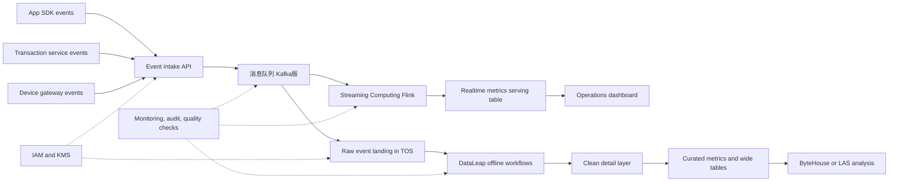

## Requirements gap check
Known facts
- Need to collect App tracking events, transaction events, and device events.
- Need minute-level operations dashboards.
- Need next-day complex analysis.

Architecture-changing gaps
- Data classification, retention, deletion, audit, and compliance boundary are unknown.
- Peak throughput, event size, late-arrival tolerance, replay window, and ordering rules are unknown.
- Dashboard concurrency, metric definitions, drill-down needs, and freshness acceptance are unknown.
- Target deployment location, availability zones, recovery target, and operations ownership are unknown.

Assumptions if unanswered
- Assumption: All three event sources can publish asynchronously with eventual consistency. Switch condition: If transaction flows require synchronous confirmation, add transaction-side confirmation and compensation.
- Assumption: Raw immutable events land in object storage; realtime serving keeps only hot metrics or derived tables. Switch condition: If dashboards require arbitrary event-level exploration, strengthen the serving analytics layer.
- Assumption: Capacity target, service target, deployment location, and commercial terms require runtime verification.

## Executive summary
Use a replayable event platform on Volcengine: Message Queue for Kafka buffers App, transaction, and device events; Streaming Computing Flink computes minute-level metrics; TOS stores immutable raw events; DataLeap governs offline workflows; ByteHouse or LAS serves next-day analysis and curated analytics.

This is bounded guidance, not production authorization. Production readiness remains blocked until data sensitivity, recovery targets, capacity target, service target, product enablement, and commercial terms are verified in the target account.

## Known facts, assumptions, and open items
Facts:
- Three event families must be integrated.
- Dashboard freshness target is minute-level.
- Complex analysis can run next day.

Assumptions:
- Events share a versioned schema with event time, source, business key, idempotency key, and payload version.
- Transaction events prioritize correctness and reconciliation; App and device events prioritize throughput and cost control.
- Realtime and offline metrics derive from the same raw event base to reduce metric drift.

Open items:
- Sensitive fields, masking rules, retention, audit evidence, and deletion propagation.
- Event volume, message size, ordering, late data, replay horizon, and dashboard concurrency.
- Target deployment location, failure-domain design, recovery target, operating owner, and budget guardrails.

```yaml
routing:
  scenario_labels: [REALTIME_DATA, BATCH_DATA, STORAGE]
  quality_labels: [LOW_LATENCY, HIGH_THROUGHPUT, HIGH_AVAILABILITY, DISASTER_RECOVERY]
  constraint_labels: [PRIVATE_NETWORK, DATA_RESIDENCY, COST_SENSITIVE]
  product_families: [data-analytics, database-storage, networking-security]
  roles: [requirements-analyst, product-researcher, domain-architect, security-reliability-reviewer, finops-reviewer]
  execution_mode: serial
  rationale: [minute-level dashboard implies realtime processing, next-day analysis implies batch or lakehouse processing, raw event retention implies storage, unresolved private boundary and recovery needs require security and reliability review, unknown scale creates cost risk]
```

## Architecture decisions
| Decision | Rationale | Alternative | Reason not selected |
| --- | --- | --- | --- |
| Use a unified event envelope | Supports schema governance, deduplication, replay, and shared metric lineage | Source-specific payloads only | Higher reconciliation and metric-drift risk |
| Buffer events before processing | Decouples producers from consumers and supports replay | Direct writes to analytics stores | Weaker failure isolation and backfill behavior |
| Split realtime and offline paths from one raw base | Meets minute dashboard and next-day analysis needs | Realtime-only pipeline | Insufficient for complex historical analysis |
| Store immutable raw events in TOS | Preserves replay and audit base | Keep only processed tables | Limits correction, backfill, and evidence review |
| Govern offline jobs with DataLeap | Adds workflow, metadata, quality, and ownership controls | Ad hoc scripts | Weaker operations and change control |

## Logical architecture


## Deployment topology
- deployment location: unresolved; runtime verification required before selecting any concrete placement.
- Availability zones: use separated failure domains where the chosen services support them; runtime verification required.
- VPC: isolate ingestion, processing, storage, governance, and query workloads in private network segments.
- Subnets: separate ingress, stream processing, data storage, analytics, and management access.
- Ingress: expose only the event intake boundary when required, protect public API paths, and keep processing and storage private.
- Disaster recovery: retain raw TOS events, Kafka offsets or checkpoints, Flink checkpoints, DataLeap job definitions, and replay runbooks before production.

## End-to-end data flow
1. App tracking events publish asynchronously over secure HTTP or SDK transport as JSON or Protobuf; failed sends retry with idempotency keys.
2. Transaction systems publish transaction events asynchronously to intake or Kafka; duplicates are removed by business key and reconciliation job.
3. Device gateways batch telemetry events; late arrivals are processed by event time when policy permits, otherwise routed to correction tables.
4. Kafka stores event streams and consumer positions; failed consumers resume from committed offsets or replay windows.
5. Flink consumes streams, validates schema, enriches events, and writes minute-level aggregates; failed jobs restore from checkpoints.
6. Raw events land in TOS partitioned by source, event type, and event date; malformed records go to quarantine storage.
7. DataLeap orchestrates next-day validation, cleansing, aggregation, and publishing; failed jobs block downstream tables and alert owners.
8. ByteHouse or LAS serves dashboard history, complex analysis, and curated metric tables; expensive analysis is isolated from realtime dashboards.

## Volcengine product mapping
| Architecture capability | Recommended Volcengine product | Responsibility | Why it fits | Alternative | Switch condition | Evidence |
| --- | --- | --- | --- | --- | --- | --- |
| Replayable event buffer | 消息队列 Kafka版 | 承担Replayable event buffer | Kafka-compatible topic buffering fits multi-source event ingestion and replayable consumers | Direct service writes | If traffic is low and replay is not required | https://www.volcengine.com/docs/6439, Retrieved: 2026-08-09 |
| Stateful realtime compute | 流式计算 Flink版 | 承担Stateful realtime compute | Fits event-time aggregation, enrichment, checkpointed realtime ETL, and minute-level metrics | Batch-only DataLeap workflow | If freshness target moves to next-day only | https://www.volcengine.com/docs/6581, Retrieved: 2026-08-09 |
| Raw event data lake | 对象存储 TOS | 承担Raw event data lake | Provides object semantics for immutable event landing and replay base | 弹性文件存储 | If workloads require mounted shared file semantics | https://www.volcengine.com/docs/6349, Retrieved: 2026-08-09 |
| Offline workflow governance | 大数据研发治理套件 DataLeap | 承担Offline workflow governance | Supports data development, workflow orchestration, governance, metadata, and quality management | Self-managed scheduler | If an existing governed scheduler is already mandated | https://www.volcengine.com/docs/6260, Retrieved: 2026-08-09 |
| Analytics serving | ByteHouse 企业版 | 承担Analytics serving | Fits event-derived analytical tables and fast dashboard or analysis queries | 湖仓一体分析服务 LAS | If lakehouse-first shared data processing is preferred | https://www.volcengine.com/docs/6464/152221, Retrieved: 2026-08-09 |
| Lakehouse analysis | 湖仓一体分析服务 LAS | 承担Lakehouse analysis | Fits lakehouse analytics over shared data-lake storage | E-MapReduce | If Hadoop ecosystem control is required | https://www.volcengine.com/docs/86403/1829870?lang=zh, Retrieved: 2026-08-09 |
| Private cloud boundary | 私有网络 | 承担Private cloud boundary | Provides isolated virtual networking, subnets, routes, and access controls | Public-only topology | Only acceptable for non-sensitive PoC | https://www.volcengine.com/docs/6401, Retrieved: 2026-08-09 |
| Identity and encryption | 访问控制 IAM plus 密钥管理系统 | 承担Identity and encryption | Centralizes authorization and managed key custody for data workflows | Long-lived embedded credentials | Not suitable for sensitive or audited data | https://www.volcengine.com/docs/6257/64959?lang=zh; https://www.volcengine.com/product/kms, Retrieved: 2026-08-09 |

## Non-functional design
- Capacity and elasticity: model event rate, payload size, partitions, state size, dashboard concurrency, and backfill windows; capacity target requires runtime verification.
- Availability: use buffered ingestion, checkpointed processing, idempotent writes, quarantines, replay, and dashboard degradation from last good aggregates.
- RTO/RPO: unresolved; design assumes raw events are replayable and derived data can be rebuilt.
- Security and compliance: private networking, least-privilege IAM, KMS-backed encryption where supported, masking, audit logs, and controlled data publishing.
- Observability: track intake success, Kafka lag, Flink checkpoint health, rejected records, DataLeap job status, data quality, query latency, and cost drivers.
- Performance: partition by source, event type, and event time; separate realtime aggregates from exploratory analysis.
- Cost: main drivers are ingestion volume, retention, stream compute, offline compute windows, query concurrency, and reprocessing; commercial terms require runtime verification.

## Implementation roadmap
PoC:
- Acceptance: one App source, one transaction source, and one device source publish valid events; Flink emits minute metrics; TOS stores raw events; DataLeap creates one next-day table.

Minimum production:
- Acceptance: schema versioning, idempotency, quarantine, alerting, access control, encryption ownership, quality checks, replay procedure, and dashboard degradation are tested.

Scale:
- Acceptance: multiple business domains onboard through contracts, data owners approve metrics, cost tags exist, retention policies run, and recovery drills pass.

## Risk and validation plan
| Risk | Probability | Impact | Mitigation | Owner | Validation method |
| --- | --- | --- | --- | --- | --- |
| Event schema drift breaks consumers | Medium | High | Versioned schema, compatibility checks, quarantines | Data platform | Replay historical samples |
| Transaction events duplicate or go missing | Medium | High | Idempotency key, reconciliation, compensation queue | Transaction owner | End-to-end reconciliation |
| Realtime and offline metrics diverge | Medium | High | Shared raw base, common metric definitions, daily diff checks | Data governance | Metric comparison report |
| Sensitive data spreads to derived tables | Medium | High | Classification, masking, IAM, audit, deletion propagation | Security owner | Access and lineage review |
| Dashboard load affects analysis | Medium | Medium | Isolate hot metric serving from exploratory analysis | Data platform | Load and failure test |
| Cost grows with retention and reprocessing | Medium | Medium | Lifecycle policy, compute windows, cost tags, owner budgets | FinOps | Monthly usage review |

## Official evidence and freshness
- Message Queue for Kafka official discovery: https://www.volcengine.com/docs/6439, Retrieved: 2026-08-09.
- Streaming Computing Flink official discovery: https://www.volcengine.com/docs/6581, Retrieved: 2026-08-09.
- TOS official discovery: https://www.volcengine.com/docs/6349, Retrieved: 2026-08-09.
- DataLeap official discovery: https://www.volcengine.com/docs/6260, Retrieved: 2026-08-09.
- ByteHouse official discovery: https://www.volcengine.com/docs/6464/152221, Retrieved: 2026-08-09.
- LAS and E-MapReduce official discovery: https://www.volcengine.com/docs/86403/1829870?lang=zh, Retrieved: 2026-08-09.
- VPC, IAM, and KMS official discovery: https://www.volcengine.com/docs/6401; https://www.volcengine.com/docs/6257/64959?lang=zh; https://www.volcengine.com/product/kms, Retrieved: 2026-08-09.
- Runtime verification required: deployment location, product enablement, connectors, capacity target, service target, recovery target, security evidence, and commercial terms.

## Completeness score
Requirements: 1
Architecture: 1
Security: 1
Reliability: 1
Cost: 1
Evidence: 1
Production readiness: NOT READY

Blocker: production readiness is blocked by unresolved data classification, recovery target, capacity target, service target, deployment location, product enablement, and commercial terms.

## Forward observations
- Requirements gap list before solution: PASS
- Only architecture-changing questions: PASS
- Facts separated from assumptions: PASS
- Product alternatives and switch conditions: PASS
- Security, reliability, observability, and cost covered: PASS
- Official evidence and retrieval dates: PASS
- Production-readiness claim appropriately bounded: PASS
