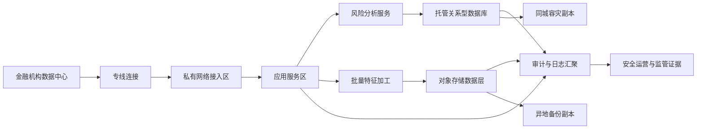

## Requirements gap check

Known facts

- 金融机构拟在火山引擎部署客户风险分析平台。
- 数据敏感。
- 要求专网接入、完整审计、同城容灾、异地备份。

Architecture-changing gaps

- 未给出客户渠道、上游核心系统、下游风控决策系统和批处理/实时处理边界。
- 未给出数据分级、留存、脱敏、密钥归属、审计留存周期和监管证据格式。
- 未给出恢复目标、容量目标、服务目标、部署地点约束和商业条款。
- 未给出现有技术栈、迁移窗口、运维分工和验收口径。

Assumptions if unanswered

- Assumption: 平台以私网 API、批量任务和风险特征服务为主，公网访问不作为首选入口。Switch condition: If 需要互联网 API 入口，则增加边界防护、应用防护和入口审计路径。
- Assumption: 交易型主数据进入托管关系型数据库，非结构化和归档数据进入对象存储。Switch condition: If 风控引擎依赖文档模型或大规模湖仓分析，则调整数据服务组合。
- Assumption: 同城容灾采用同一部署地点内多故障域部署，异地备份采用独立部署地点的备份副本。Switch condition: If 监管要求指定地点或更严格恢复目标，则以运行时核验后的可用方案重设拓扑。
- Assumption: 本答复不进行联网核验。Switch condition: Before procurement or go-live, verify deployment location, commercial terms, capacity target, service target, product availability, and exact operational constraints on official Volcengine pages.

## Executive summary

建议采用“私网接入 + 分层安全域 + 托管数据底座 + 集中审计 + 同城高可用 + 异地备份”的平台架构。核心路径是金融机构机房通过专线连接进入火山引擎私有网络，业务服务部署在隔离子网内，敏感数据进入托管数据库和对象存储，日志、操作、网络访问和数据处理链路统一留痕。

本方案是受限设计：由于禁止联网核验，所有部署地点、商业条款、容量目标、服务目标、产品可用性和精确运行约束均标记为 runtime verification required，不作为上线授权。

## Known facts, assumptions, and open items

Facts

- 业务目标：客户风险分析平台。
- 约束：敏感数据、专网接入、完整审计、同城容灾、异地备份。
- 质量标签：HIGH_AVAILABILITY、DISASTER_RECOVERY。
- 约束标签：PRIVATE_NETWORK、DATA_RESIDENCY、REGULATED。
- 场景标签：BATCH_DATA、DATABASE、STORAGE。

Assumptions

- 数据处理包含批量特征加工、风险评分查询、结果回写和审计归档。
- 应用服务采用容器或云主机承载；数据库为系统记录层，对象存储为原始数据、模型输入输出和备份归档层。
- 管理访问经堡垒、身份权限和审计策略控制，生产身份与人员身份分离。
- 灾备演练和恢复验收由金融机构、云平台团队和应用团队共同负责。

Open items

- 部署地点及数据驻留边界。
- 恢复目标、服务目标和容量目标。
- 数据分类、脱敏、加密、密钥托管和删除策略。
- 审计日志范围、留存周期、监管报送格式。
- 源系统协议、数据规模、调用模式和峰谷特征。
- 采购账号下的产品可用性与商业条款。

Routing notes

```yaml
routing:
  scenario_labels: [BATCH_DATA, DATABASE, STORAGE]
  quality_labels: [HIGH_AVAILABILITY, DISASTER_RECOVERY]
  constraint_labels: [PRIVATE_NETWORK, DATA_RESIDENCY, REGULATED]
  product_families: [networking-security, data-analytics, database-storage]
  roles: [requirements-analyst, product-researcher, domain-architect, security-reliability-reviewer]
  execution_mode: serial
  rationale:
    - 私网接入和金融敏感数据触发 networking-security。
    - 风险分析与特征加工触发 data-analytics。
    - 交易型记录、结果存储和备份归档触发 database-storage。
    - 受监管、同城容灾和异地备份触发 security-reliability review。
```

## Architecture decisions

| Decision | Rationale | Alternative | Reason not selected |
| --- | --- | --- | --- |
| 以专线连接作为机构到云上主通道 | 满足专网接入和路由可控要求 | VPN 或公网加密通道 | 金融敏感数据场景下，公网暴露和链路稳定性需要更强约束 |
| 用私有网络划分接入区、应用区、数据区、管理区 | 降低横向移动风险，便于审计和策略隔离 | 单一扁平网络 | 不利于最小权限和故障隔离 |
| 用 IAM、KMS、审计日志和网络安全策略组合实现完整审计 | 身份、密钥、网络、数据访问需要统一证据链 | 仅依赖应用日志 | 无法覆盖云资源操作、网络访问和密钥使用 |
| 关系型数据库保存客户风险记录和评分结果 | 风险结果通常需要事务、索引和一致性边界 | 文档数据库 | 仅在数据模型以文档聚合为主时切换 |
| 对象存储保存原始文件、离线特征、归档和备份副本 | 适合非结构化、归档和数据湖落地 | 共享文件存储 | 仅在应用必须挂载文件协议时切换 |
| 同城采用多故障域应用部署和数据高可用能力 | 支撑单点故障隔离和服务连续性 | 单实例部署 | 不满足容灾目标 |
| 异地采用备份副本和恢复演练 | 降低地点级风险 | 全量双活 | 成本和一致性复杂度更高，需明确业务恢复目标后再决策 |

## Logical architecture



Components

- 接入层：专线连接、路由策略、私有网络边界。
- 应用层：风险评分 API、批量任务、调度服务、管理服务。
- 数据层：托管关系型数据库、对象存储、缓存可选。
- 安全层：IAM、KMS、云防火墙、审计日志、最小权限策略。
- 运维层：监控、告警、日志、备份校验、恢复演练。

## Deployment topology

- Deployment location: runtime verification required。主生产部署地点需满足金融机构数据驻留、监管和采购账号可用性要求。
- Fault domains: 应用服务跨多个故障域部署；数据库采用托管高可用形态，具体形态 runtime verification required。
- VPC: 单生产私有网络内按接入区、应用区、数据区、管理区拆分子网；生产、测试、开发环境分账号或分网络隔离。
- Subnets: 接入子网承载专线路由；应用子网承载服务计算；数据子网仅允许应用与运维受控路径访问；管理子网仅允许堡垒和审计组件。
- Ingress: 默认仅专网入口；若新增互联网入口，必须先通过应用防护、边界防护、证书管理和审计策略评审。
- Disaster recovery relationship: 同城容灾用于故障域级恢复；异地备份用于地点级恢复。恢复目标和切换流程 runtime verification required。
- Management plane: 人员访问使用身份联合、最小权限、临时凭证和操作审计；高危操作需审批和复核。

## End-to-end data flow

1. Source ingestion: 金融机构核心系统通过专线连接同步或异步传输客户、交易、授信和行为数据；协议由源系统决定；敏感字段进入数据分类和脱敏处理；失败时进入重试队列并产生审计事件。
2. Batch feature flow: 批量任务从对象存储或数据库读取原始数据，生成特征表和风险指标；中间结果写入受控存储；失败时保留输入快照、任务日志和可重跑标识。
3. Online scoring flow: 内部业务系统通过私网 API 调用风险分析服务；服务读取数据库、缓存和特征数据，返回评分结果；超时或依赖失败时按降级策略返回可解释状态并记录审计。
4. Result persistence: 风险评分、模型版本标识、规则命中、人工复核状态写入关系型数据库；对象存储保存批量输出和归档材料；写入失败触发补偿任务。
5. Audit flow: 身份操作、资源变更、网络访问、数据读写、密钥使用和应用审计日志汇聚到集中日志层；安全团队按策略检索、告警和导出证据。
6. Backup and restore flow: 数据库备份、对象副本和关键配置按策略复制到异地备份目标；定期执行恢复演练；演练失败时阻断生产放行。
7. Security incident flow: 异常访问、越权尝试或数据导出异常触发告警；安全运营执行隔离、凭证轮换、日志保全和复盘。

## Volcengine product mapping

| Architecture capability | Recommended Volcengine product | Why it fits | Alternative | Switch condition | Evidence |
| --- | --- | --- | --- | --- | --- |
| 私有网络边界 | 私有网络 | 提供隔离网络、子网、路由和安全组能力，适合承载金融生产分区 | 多账号多 VPC 拆分 | If 多法人、多业务线或更强隔离要求成立，则拆分网络和账号 | Official discovery: https://www.volcengine.com/docs/6401 |
| 机构到云专网接入 | 专线连接 | 支持数据中心到云上私网的专用连接模式 | VPN | If 仅 PoC 或临时测试，且风险评审允许，可短期使用加密隧道 | Official discovery: https://www.volcengine.com/docs/6407 |
| 内部流量分发 | 负载均衡 | 为多后端服务提供统一入口、健康检查和流量分发 | 应用自建反向代理 | If 协议或源地址保留需求不满足，则评估自建代理或不同入口形态 | Official discovery: https://www.volcengine.com/docs/6406 |
| 身份与权限 | 访问控制 IAM | 支持身份、策略、角色和临时凭证治理 | 应用内账号体系 | If 仅管理应用内权限，仍需云资源权限由 IAM 管控 | Official discovery: https://www.volcengine.com/docs/6257/64959?lang=zh |
| 密钥与加密 | 密钥管理系统 | 支持托管密钥、加密操作和密钥治理 | 应用自管密钥 | If 监管要求自持硬件或特殊托管模型，则另行评估 | Official discovery: https://www.volcengine.com/product/kms |
| 网络边界审计与防护 | 云防火墙 | 用于网络边界策略、流量可视和安全审计 | 仅安全组和网络 ACL | If 流量路径极简且安全评审接受，可先用基础网络策略 | Official discovery: https://www.volcengine.com/docs/6516 |
| 关系型数据存储 | 云数据库 MySQL 版或云数据库 PostgreSQL 版 | 适合风险记录、任务状态和结果持久化，具体引擎按应用兼容性选择 | veDB MySQL 版 | If 读扩展和云原生数据库能力更关键，则验证 veDB MySQL 兼容性 | Official discovery: https://www.volcengine.com/docs/6313 ; https://www.volcengine.com/docs/6438 ; https://www.volcengine.com/docs/6357 |
| 对象与归档数据 | 对象存储 TOS | 适合原始文件、离线特征、审计导出和备份归档 | 弹性文件存储 | If 应用必须使用挂载文件协议，则评估弹性文件存储 | Official discovery: https://www.volcengine.com/docs/6349 ; https://www.volcengine.com/docs/6453 |
| 数据研发治理 | DataLeap | 可承载数据开发、调度、元数据和质量治理工作 | E-MapReduce 或 LAS | If 需要 Hadoop 生态控制选择 E-MapReduce；If 湖仓分析为主选择 LAS | Official discovery: https://www.volcengine.com/docs/6260 ; https://www.volcengine.com/docs/86403/1829870?lang=zh |
| 应用入口防护 | Web应用防火墙 | 仅在出现公网 Web 或 API 入口时启用 | 私网入口加云防火墙 | If 入口保持纯专网，则 WAF 可作为条件项 | Official discovery: https://www.volcengine.com/docs/6511 |

## Non-functional design

Security and compliance

- 所有生产资源进入私有网络，默认无公网入口。
- 子网、路由、安全组、网络边界策略按最小访问面配置。
- IAM 使用角色、临时凭证和职责分离；高危权限需审批。
- KMS 管理密钥生命周期；敏感数据落库、对象存储和备份均需加密策略。
- 审计覆盖人员操作、服务身份、网络访问、数据读写、密钥使用、配置变更和备份恢复。
- 日志写入独立审计存储，限制删除权限，并建立证据导出流程。

Reliability and recovery

- 应用服务无状态化并跨故障域部署。
- 数据库启用托管高可用能力，具体形态 runtime verification required。
- 对象存储和数据库备份进入异地备份路径。
- 所有恢复流程必须演练，演练记录进入审计证据。
- 恢复目标未明确前，不承诺生产切换能力。

Observability

- 指标：业务成功率、评分延迟、任务成功率、数据新鲜度、错误率、备份状态、恢复演练结果。
- 日志：应用、数据库、对象访问、网络边界、身份操作、密钥调用和调度任务。
- 告警：异常登录、越权访问、批任务失败、备份失败、延迟异常、数据质量异常。

Performance and capacity

- Capacity target: runtime verification required。
- 在线评分路径需设置超时、熔断、缓存和降级结果。
- 批处理路径需支持重跑、分区处理和资源隔离。
- 数据库需压测连接池、索引、慢查询和备份影响。
- 对象存储需验证文件布局、生命周期和读取模式。

Cost

- Commercial terms: runtime verification required。
- 主要成本驱动包括专线连接、计算资源、数据库、对象存储、日志留存、异地备份和安全产品。
- 成本控制通过环境隔离、存储生命周期、日志分级、批任务调度窗口和资源标签实现。

Independent security and reliability review result

- 当前设计覆盖了网络隔离、身份、密钥、审计、容灾和备份主路径。
- 阻断项：恢复目标、数据驻留边界、审计留存、产品可用性、商业条款和服务目标均未核验。
- 结论：可进入方案评审和 PoC，不可直接进入生产发布。

## Implementation roadmap

PoC phase

- Scope: 专线接入样板、私有网络分区、样例风险评分服务、样例数据库、对象存储、审计日志汇聚。
- Acceptance criteria: 能通过专网调用评分 API；能完成样例批处理；能追踪一条数据从进入到结果输出的日志链；能执行一次样例恢复。

Minimum production phase

- Scope: 生产账号与权限、正式网络分区、数据库高可用配置、备份策略、KMS、审计策略、告警、运维手册和应急流程。
- Acceptance criteria: 安全评审通过；恢复演练通过；权限复核通过；数据分类和留存策略落地；上线回退方案通过评审。

Scale phase

- Scope: 多业务线接入、特征平台治理、数据质量规则、自动化发布、成本标签、容量压测、跨地点恢复演练。
- Acceptance criteria: 关键业务流程有可观测指标；批量和在线链路可扩展；审计证据可导出；恢复演练形成固定制度。

## Risk and validation plan

| Risk | Probability | Impact | Mitigation | Owner | Validation method |
| --- | --- | --- | --- | --- | --- |
| 数据驻留边界不满足监管要求 | Medium | High | 在采购和部署前完成部署地点核验与法务评审 | 合规负责人 | 合规清单和官方页面核验 |
| 专线交付周期影响项目计划 | Medium | High | 提前规划线路、冗余路径和临时测试通道 | 网络负责人 | 连通性测试和交付验收 |
| 审计范围遗漏 | Medium | High | 建立操作、网络、数据、密钥、应用五类审计矩阵 | 安全负责人 | 抽样追踪和证据导出 |
| 恢复目标不清导致灾备不可验收 | High | High | 明确业务恢复目标并固化演练剧本 | 业务连续性负责人 | 恢复演练报告 |
| 数据库或分析引擎兼容性不足 | Medium | Medium | 用真实 SQL、驱动、任务和数据样本做兼容测试 | 应用负责人 | PoC 测试报告 |
| 日志留存和备份成本失控 | Medium | Medium | 分级留存、生命周期策略和成本标签 | FinOps 负责人 | 月度账单复盘和策略审查 |
| 密钥职责不清 | Medium | High | 明确密钥管理员、使用者、审计者和应急流程 | 安全负责人 | 权限复核和轮换演练 |

## Official evidence and freshness

No live retrieval was performed because browsing is disallowed. The following are official Volcengine discovery entry points from local skill references and require runtime verification before procurement, detailed design freeze, or production launch.

| Evidence area | Official URL | Evidence level | Freshness |
| --- | --- | --- | --- |
| VPC and private networking | https://www.volcengine.com/docs/6401 | A-level discovery entry | runtime verification required |
| Load balancing | https://www.volcengine.com/docs/6406 | A-level discovery entry | runtime verification required |
| Direct Connect | https://www.volcengine.com/docs/6407 | A-level discovery entry | runtime verification required |
| IAM | https://www.volcengine.com/docs/6257/64959?lang=zh | A-level discovery entry | runtime verification required |
| KMS | https://www.volcengine.com/product/kms | A-level discovery entry | runtime verification required |
| Cloud Firewall | https://www.volcengine.com/docs/6516 | A-level discovery entry | runtime verification required |
| WAF | https://www.volcengine.com/docs/6511 | A-level discovery entry | runtime verification required |
| MySQL | https://www.volcengine.com/docs/6313 | A-level discovery entry | runtime verification required |
| PostgreSQL | https://www.volcengine.com/docs/6438 | A-level discovery entry | runtime verification required |
| veDB MySQL | https://www.volcengine.com/docs/6357 | A-level discovery entry | runtime verification required |
| Object Storage TOS | https://www.volcengine.com/docs/6349 | A-level discovery entry | runtime verification required |
| Elastic File Storage | https://www.volcengine.com/docs/6453 | A-level discovery entry | runtime verification required |
| DataLeap | https://www.volcengine.com/docs/6260 | A-level discovery entry | runtime verification required |
| Volcengine Trust Center | https://www.volcengine.com/trust/security | A-level discovery entry | runtime verification required |

Runtime verification required for deployment location, commercial terms, capacity target, service target, product availability, exact operating constraints, supported protocols, backup behavior, recovery behavior, log retention, compliance evidence, and account-level enablement.

## Completeness score

Requirements: 1
Architecture: 1
Security: 1
Reliability: 1
Cost: 1
Evidence: 1
Production readiness: NOT READY

Blocker: deployment location, recovery target, data classification, audit retention, product availability, commercial terms, capacity target, and service target remain unverified.

## Forward observations
- Requirements gap list before solution: PASS
- Only architecture-changing questions: PASS
- Facts separated from assumptions: PASS
- Product alternatives and switch conditions: PASS
- Security, reliability, observability, and cost covered: PASS
- Official evidence and retrieval dates: PASS
- Production-readiness claim appropriately bounded: PASS
