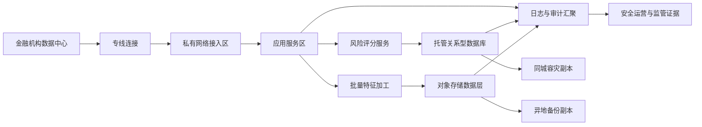

## Requirements gap check

Known facts

- 金融机构拟在火山引擎部署客户风险分析平台。
- 数据敏感。
- 要求专网接入、完整审计、同城容灾、异地备份。

Architecture-changing gaps

- 未给出客户渠道、源系统、下游风控系统、批处理与在线评分边界。
- 未给出数据分级、留存、脱敏、密钥归属、审计留存周期和监管证据格式。
- 未给出恢复目标、容量目标、服务目标、部署地点约束和商业条款。
- 未给出现有数据库、数据研发栈、迁移窗口、运维分工和验收口径。

Assumptions if unanswered

- Assumption: 平台以私网 API、批量任务和风险结果查询为主。Switch condition: If 需要互联网入口，则增加应用防护、边界防护和入口审计路径。
- Assumption: 交易型风险记录进入托管关系型数据库，原始文件、离线特征、审计导出和备份归档进入对象存储。Switch condition: If 主数据模型为文档聚合，则验证文档数据库替代。
- Assumption: 同城容灾采用同一部署地点内多故障域部署，异地备份采用独立部署地点的备份副本。Switch condition: If 监管指定部署地点或恢复目标更严格，则以运行时核验后的拓扑重设方案。
- Assumption: 本方案不进行联网核验。Switch condition: Before procurement or go-live, verify deployment location, commercial terms, capacity target, service target, product availability, and exact operational constraints on official Volcengine pages.

## Executive summary

建议采用“专线接入 + 私有网络分区 + 托管数据底座 + 统一审计 + 同城高可用 + 异地备份”的客户风险分析平台架构。金融机构机房通过专线连接进入火山引擎私有网络，应用服务部署在隔离子网，风险记录使用托管关系型数据库，原始数据、离线特征、审计导出和备份归档使用对象存储，身份、密钥、网络边界和日志证据统一纳入安全治理。

本方案可用于方案评审和 PoC，不可直接作为生产发布授权；部署地点、商业条款、服务目标、容量目标、产品可用性和恢复指标均需运行时核验。

## Known facts, assumptions, and open items

Facts

- 业务目标：客户风险分析平台。
- 约束：敏感数据、专网接入、完整审计、同城容灾、异地备份。
- 场景标签：BATCH_DATA、DATABASE、STORAGE。
- 质量标签：HIGH_AVAILABILITY、DISASTER_RECOVERY。
- 约束标签：PRIVATE_NETWORK、DATA_RESIDENCY、REGULATED。

Assumptions

- 数据处理包含批量特征加工、风险评分查询、结果回写和审计归档。
- 应用服务可由容器或云主机承载，计算形态在 PoC 中按团队运维能力确认。
- 管理访问经身份权限、临时凭证、审批和审计策略控制。
- 灾备演练由金融机构、云平台团队、应用团队和安全团队共同验收。

Open items

- 部署地点、数据驻留边界、监管证据清单。
- 恢复目标、服务目标、容量目标。
- 数据分类、脱敏、加密、密钥托管和删除策略。
- 审计日志范围、留存周期、导出格式。
- 源系统协议、数据规模、峰谷特征、迁移方式。
- 采购账号下的产品可用性与商业条款。

```yaml
routing:
  scenario_labels: [BATCH_DATA, DATABASE, STORAGE]
  quality_labels: [HIGH_AVAILABILITY, DISASTER_RECOVERY]
  constraint_labels: [PRIVATE_NETWORK, DATA_RESIDENCY, REGULATED]
  product_families: [networking-security, data-analytics, database-storage]
  roles: [requirements-analyst, product-researcher, domain-architect, security-reliability-reviewer]
  execution_mode: serial
  rationale:
    - 专网接入、敏感数据和完整审计触发 networking-security。
    - 风险特征加工和批量任务触发 data-analytics。
    - 风险记录、归档和备份触发 database-storage。
    - 受监管、同城容灾和异地备份触发安全可靠性复核。
```

## Architecture decisions

| Decision | Rationale | Alternative | Reason not selected |
| --- | --- | --- | --- |
| 以专线连接作为机构到云上主通道 | 满足专网接入、路由可控和低暴露面要求 | VPN 或公网加密通道 | 仅适合 PoC 或临时测试，生产金融敏感数据路径风险更高 |
| 用私有网络拆分接入区、应用区、数据区、管理区 | 支持最小权限、审计边界和故障隔离 | 单一扁平网络 | 横向移动风险和变更影响面更大 |
| 用 IAM、KMS、云防火墙和日志审计形成证据链 | 身份、密钥、网络和数据访问都需可追踪 | 仅应用日志 | 无法覆盖云资源操作、网络边界和密钥使用 |
| 用托管关系型数据库保存风险记录和评分结果 | 适合事务、索引、状态和结果持久化 | 文档数据库 | 仅在主数据模型以文档聚合为主时切换 |
| 用对象存储保存原始文件、离线特征、审计导出和备份归档 | 适合对象语义、归档和数据湖落地 | 弹性文件存储 | 仅在应用必须挂载文件协议时切换 |
| 同城多故障域部署，异地备份副本 | 先满足故障域恢复和地点级恢复证据 | 全量双活 | 成本、数据一致性和切换复杂度需恢复目标确认后再定 |

## Logical architecture



## Deployment topology

- Deployment location: runtime verification required；主生产部署地点必须满足金融机构数据驻留、监管和账号可用性约束。
- Fault domains: 应用服务跨多个故障域部署；数据库高可用形态 runtime verification required。
- VPC: 单生产私有网络内按接入、应用、数据、管理拆分子网；生产、测试、开发环境隔离。
- Subnets: 接入子网承载专线路由；应用子网承载服务；数据子网仅允许受控应用访问；管理子网仅允许堡垒、审计和授权运维路径。
- Ingress: 默认仅专网入口；新增互联网入口前必须完成应用防护、边界防护、证书管理和审计评审。
- Disaster recovery relationship: 同城容灾用于故障域级恢复；异地备份用于地点级恢复；恢复目标和切换流程 runtime verification required。

## End-to-end data flow

1. Source ingestion: 核心系统通过专线连接同步或异步传输客户、交易、授信和行为数据；协议由源系统决定；敏感字段进入分类和脱敏处理；失败时重试并记录审计事件。
2. Batch feature flow: 批量任务从对象存储或数据库读取数据，生成特征和风险指标；中间结果写入受控存储；失败时保留输入快照、任务日志和可重跑标识。
3. Online scoring flow: 内部业务系统通过私网 API 调用风险评分服务；服务读取数据库、缓存可选层和特征数据；超时或依赖失败时返回可解释状态并记录审计。
4. Result persistence: 评分、规则命中、模型版本、人工复核状态写入关系型数据库；批量输出和归档材料写入对象存储；写入失败触发补偿任务。
5. Audit flow: 身份操作、资源变更、网络访问、数据读写、密钥使用和应用日志汇聚到审计层；安全团队按策略检索、告警和导出证据。
6. Backup and restore flow: 数据库备份、对象副本和关键配置复制到异地备份目标；定期恢复演练；演练失败阻断生产放行。

## Volcengine product mapping

| Architecture capability | Recommended Volcengine product | Why it fits | Alternative | Switch condition | Evidence |
| --- | --- | --- | --- | --- | --- |
| 私有网络边界 | 私有网络 | 提供隔离网络、子网、路由和安全组能力，适合金融生产分区 | 多账号多 VPC 拆分 | If 多法人、多业务线或强隔离要求成立，则拆分网络和账号 | https://www.volcengine.com/docs/6401 Retrieved: 2026-08-09 |
| 机构到云专网接入 | 专线连接 | 支持数据中心到云上私网的专用连接模式 | VPN | If 仅 PoC 且风险评审允许，可短期使用加密隧道 | https://www.volcengine.com/docs/6407 Retrieved: 2026-08-09 |
| 内部流量分发 | 负载均衡 | 为多后端服务提供统一入口、健康检查和流量分发 | 应用自建反向代理 | If 协议或源地址保留需求不满足，则评估自建代理 | https://www.volcengine.com/docs/6406 Retrieved: 2026-08-09 |
| 身份与权限 | 访问控制 IAM | 支持身份、策略、角色和临时凭证治理 | 应用内账号体系 | If 仅管应用内权限，云资源权限仍由 IAM 管控 | https://www.volcengine.com/docs/6257/64959?lang=zh Retrieved: 2026-08-09 |
| 密钥与加密 | 密钥管理系统 | 支持托管密钥、加密操作和密钥治理 | 应用自管密钥 | If 监管要求特殊密钥托管模型，则另行评估 | https://www.volcengine.com/product/kms Retrieved: 2026-08-09 |
| 网络边界审计与防护 | 云防火墙 | 用于网络边界策略、流量可视和安全审计 | 仅安全组和网络 ACL | If 流量路径极简且安全评审接受，可先用基础网络策略 | https://www.volcengine.com/docs/6516 Retrieved: 2026-08-09 |
| 关系型数据存储 | 云数据库 MySQL 版或云数据库 PostgreSQL 版 | 适合风险记录、任务状态和结果持久化，具体引擎按应用兼容性选择 | veDB MySQL 版 | If 读扩展和云原生数据库能力更关键，则验证 veDB MySQL 兼容性 | https://www.volcengine.com/docs/6313 Retrieved: 2026-08-09; https://www.volcengine.com/docs/6438 Retrieved: 2026-08-09; https://www.volcengine.com/docs/6357 Retrieved: 2026-08-09 |
| 对象与归档数据 | 对象存储 TOS | 适合原始文件、离线特征、审计导出和备份归档 | 弹性文件存储 | If 应用必须使用挂载文件协议，则评估弹性文件存储 | https://www.volcengine.com/docs/6349 Retrieved: 2026-08-09; https://www.volcengine.com/docs/6453 Retrieved: 2026-08-09 |
| 数据研发治理 | DataLeap | 可承载数据开发、调度、元数据和质量治理工作 | E-MapReduce 或 LAS | If 需 Hadoop 生态控制选 E-MapReduce；If 湖仓分析为主选 LAS | https://www.volcengine.com/docs/6260 Retrieved: 2026-08-09; https://www.volcengine.com/docs/86403/1829870?lang=zh Retrieved: 2026-08-09 |

## Non-functional design

Security and compliance: 生产资源默认无公网入口；子网、路由、安全组和边界策略按最小访问面配置；IAM 使用角色、临时凭证和职责分离；KMS 管理密钥生命周期；审计覆盖人员操作、服务身份、网络访问、数据读写、密钥使用、配置变更和备份恢复。

Reliability and recovery: 应用服务无状态化并跨故障域部署；数据库启用托管高可用形态，具体形态 runtime verification required；对象存储和数据库备份进入异地备份路径；所有恢复流程必须演练并留存证据；恢复目标未明确前不承诺生产切换能力。

Observability: 指标覆盖业务成功率、评分延迟、任务成功率、数据新鲜度、错误率、备份状态和恢复演练结果；日志覆盖应用、数据库、对象访问、网络边界、身份操作、密钥调用和调度任务。

Performance and cost: Capacity target and commercial terms: runtime verification required；在线评分路径设置超时、熔断、缓存和降级；批处理路径支持重跑、分区处理和资源隔离；成本驱动包括专线连接、计算、数据库、对象存储、日志留存、异地备份和安全产品。

Independent security and reliability review result: 当前设计覆盖网络隔离、身份、密钥、审计、容灾和备份主路径；阻断项为恢复目标、数据驻留边界、审计留存、产品可用性、商业条款和服务目标未核验；结论为可进入评审和 PoC，不可生产发布。

## Implementation roadmap

PoC phase: 建立专线接入样板、私有网络分区、样例风险评分服务、样例数据库、对象存储和审计日志汇聚；验收为能通过专网调用评分 API、完成样例批处理、追踪一条数据全链路并执行样例恢复。

Minimum production phase: 完成生产账号权限、正式网络分区、数据库高可用配置、备份策略、KMS、审计策略、告警、运维手册和应急流程；验收为安全评审、恢复演练、权限复核、数据分类和上线回退方案通过。

Scale phase: 扩展多业务线接入、特征治理、数据质量规则、自动化发布、成本标签、容量压测和跨地点恢复演练；验收为关键流程可观测、批量和在线链路可扩展、审计证据可导出、恢复演练制度化。

## Risk and validation plan

| Risk | Probability | Impact | Mitigation | Owner | Validation method |
| --- | --- | --- | --- | --- | --- |
| 数据驻留边界不满足监管要求 | Medium | High | 部署前完成部署地点核验与法务评审 | 合规负责人 | 合规清单和官方页面核验 |
| 专线交付周期影响项目计划 | Medium | High | 提前规划线路、冗余路径和临时测试通道 | 网络负责人 | 连通性测试和交付验收 |
| 审计范围遗漏 | Medium | High | 建立操作、网络、数据、密钥、应用五类审计矩阵 | 安全负责人 | 抽样追踪和证据导出 |
| 恢复目标不清导致灾备不可验收 | High | High | 明确业务恢复目标并固化演练剧本 | 业务连续性负责人 | 恢复演练报告 |
| 数据库或分析引擎兼容性不足 | Medium | Medium | 用真实 SQL、驱动、任务和数据样本做兼容测试 | 应用负责人 | PoC 测试报告 |
| 日志留存和备份成本失控 | Medium | Medium | 分级留存、生命周期策略和成本标签 | FinOps 负责人 | 月度账单复盘 |

## Official evidence and freshness

- 私有网络: https://www.volcengine.com/docs/6401 Retrieved: 2026-08-09, A-level discovery evidence.
- 专线连接: https://www.volcengine.com/docs/6407 Retrieved: 2026-08-09, A-level discovery evidence.
- 负载均衡: https://www.volcengine.com/docs/6406 Retrieved: 2026-08-09, A-level discovery evidence.
- IAM: https://www.volcengine.com/docs/6257/64959?lang=zh Retrieved: 2026-08-09, A-level discovery evidence.
- KMS: https://www.volcengine.com/product/kms Retrieved: 2026-08-09, A-level discovery evidence.
- 云防火墙: https://www.volcengine.com/docs/6516 Retrieved: 2026-08-09, A-level discovery evidence.
- 数据库、对象存储和数据研发治理: cited in product mapping with Retrieved: 2026-08-09.
- Dynamic/current items needing runtime verification: deployment location, commercial terms, capacity target, service target, product availability, exact recovery design, exact operational constraints.

## Completeness score

Requirements: 1
Architecture: 1
Security: 1
Reliability: 1
Cost: 1
Evidence: 1
Production readiness: NOT READY

Blocker: critical deployment, recovery, audit, commercial, capacity, service, data-residency, and product-availability items remain unresolved and require runtime verification before production.

## Forward observations
- Requirements gap list before solution: PASS
- Only architecture-changing questions: PASS
- Facts separated from assumptions: PASS
- Product alternatives and switch conditions: PASS
- Security, reliability, observability, and cost covered: PASS
- Official evidence and retrieval dates: PASS
- Production-readiness claim appropriately bounded: PASS
